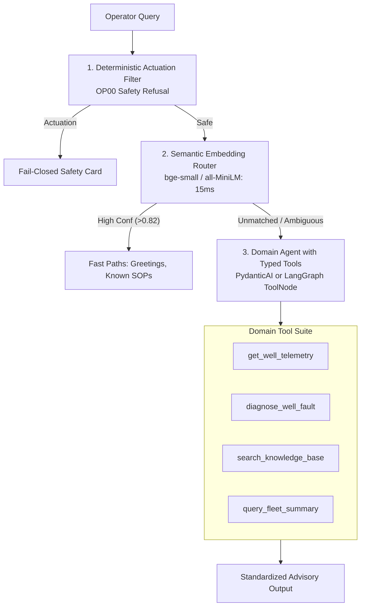

# Engineering Handoff Document: ESP Autonomous Operations & Predictive Diagnostics

> **Target Audience:** Lead AI/ML & Platform Engineer  
> **Repository:** `x:/TAS/Agentic_project/`  
> **System Scope:** Electric Submersible Pump (ESP) Predictive Maintenance, Autonomous SCADA Diagnostics, and LLM Copilot  
> **Status Date:** September 2026  

---

## 1. Repository Directory Structure

```text
x:/TAS/Agentic_project/
│
├── 🚀 Launchers & Entry Points
│   ├── agent_streamlit.py            # Conversational AI Agent Web UI (Streamlit Port 8501/8502)
│   ├── run_all_services.py           # Multi-process service orchestrator & TCP/HTTP health prober
│   ├── run_full_query_pipeline.py     # End-to-end integration test runner
│   ├── start_all_services.bat        # 1-click startup batch script (Docker, LLM, APIs, UI)
│   ├── start_streamlit.bat           # Dedicated Streamlit agent launcher
│   ├── start_gpu_llm.bat             # Local LLM CUDA runner (llama-server Qwen2.5-Coder-3B)
│   └── stop_all_services.bat         # Graceful multi-port shutdown script (8000, 8080, 8090, 8501, 8502)
│
├── 🎯 4-Visual Forensic Specifications
│   ├── visual1.md                    # Forensic Tipping Timeline specification
│   ├── visual2.md                    # Subsystem Equalizer & Pressure Depth Profile specification
│   ├── visual3.md                    # In-Situ H-Q Pump Performance Curve specification
│   ├── visual4.md                    # SHAP Feature Attribution Waterfall & SOP Playbook specification
│   └── visual_implementation_plan.md # Master Tab 11 forensic roadmap
│
├── 📚 Architecture & System Documentation
│   ├── REPOSITORY_STRUCTURE.md       # Master repo architecture & agent dependency guide
│   ├── AGENT_ARCHITECTURE.md         # Multi-agent LangGraph cognitive design & state machine
│   ├── stage0_audit.md               # Executive report on reference registries & baseline envelopes
│   ├── dashboard_audit_report.md     # ML dashboard & visual audit report
│   ├── Plan.md                       # Project milestones, verification criteria & contracts
│   └── README.md                     # Main repository guide
│
└── 📁 Core Subsystems
    ├── cced_esp/                     # Backend API (:8000), ML inference, live telemetry & React UI
    │   ├── backend/                  # FastAPI historian endpoints, database transformers
    │   ├── data/                     # SQLite databases (normalized.db, unlabelled.db, labelled.db)
    │   └── frontend/                 # React-based operator dashboard (Incomplete / Experimental)
    │
    ├── esp_agent/                    # Cognitive supervisor, specialists, RAG knowledge bases
    │   ├── docker-compose.yml        # Neo4j, PostgreSQL/pgvector, Qdrant, Redis containers
    │   ├── knowledge_bases/esp/      # API RP 11S docs, failure rules, objective JSONs, graph JSON
    │   ├── scripts/                  # DB initializers & seeders (seed_db.py, seed_neo4j.py, seed_qdrant.py)
    │   ├── src/agent/                # LangGraph supervisor (graph.py), intent router, specialists
    │   ├── src/adapters/             # Asset service (Advait 73-well cache), telemetry adapters
    │   ├── src/services/             # Procedure knowledge service, history analytics, engineering
    │   └── tests/                    # 56+ pytest test suites (contracts, RAG triad, vertical slices)
    │
    ├── code/                         # EDA dashboard (10 tabs) & figure_factory.py Plotly engine
    │   ├── eda/dashboard.py          # 10-tab Streamlit engineering dashboard (port 8501)
    │   ├── models/                   # Core ML models (Isolation Forest, 13-fault classifier, calibration registry)
    │   └── figure_factory.py         # Production Plotly forensic visualization generators
    │
    ├── esp-knowledge/                # API RP 11S standards, OEM pump specs & alert playbooks
    │   └── deterministic/alerts/     # seed_alerts.yaml (governing alarm & tripping thresholds)
    │
    ├── data/                         # Asset context and catalog seeds
    │   └── advait/                   # asset_context_initial_seed_v2_rich.json (73 well nameplate specs)
    │
    ├── bin/llama-cpp/                # Pre-compiled llama-server.exe (CUDA-enabled)
    └── models/                       # Local GGUF LLM weights (Qwen2.5-Coder-3B-Instruct-Q4_K_M.gguf)
```

---

## 2. Current Project Status

### What is 100% Complete & Verified
1. **Tier 0: Operational Safety Refusal Policy (`OP00_OPERATIONAL_CONTROL`)**
   - Fail-closed deterministic refusal for actuation, speed adjustment, or remote pump shutdown commands per API RP 11S / CCED safety policy. Verified in test suites and UI.
2. **Tier 1: Knowledge Base & Procedural Retrieval (`OP06_PROCEDURE_LOOKUP`)**
   - 50/50 test benchmark verified with 288 zero-hallucination citations.
   - Comprehensive procedural flows for backspin lockout, startup ramps, gas lock mitigation, broken shaft procedures, and governing operating thresholds.
   - Authoritative 4-part ESP failure modes catalog (Thermal/Electrical, Hydraulic/Gas, Mechanical/Structural, Reservoir/Fluid).
3. **Tier 1: General Conversational & Concepts (`OP07_GENERAL_INQUIRY`)**
   - Direct conversational LLM path without live telemetry overhead or false well prompts.
4. **Tier 2: Single-Well Telemetry Snapshot (`OP01_CURRENT_STATUS`)**
   - 52/52 automated tests passing (`test_op01_vertical_slice.py`).
   - Live telemetry ingestion, corridor comparisons against baseline envelopes, 20-minute staleness threshold detection, and degraded raw corridor fallbacks.
5. **Core ML Models Package (`code/models/`)**
   - `WellCalibrationRegistry`: Baseline statistical envelopes ($p_{10}$, median, $p_{90}$, mean, std, min, max) for **73 CCED wells**.
   - `MultivariateAnomalyDetector`: Unsupervised **Isolation Forest** (100 estimators, 2% contamination) on normalized $[0, 1]$ telemetry.
   - `FaultClassificationEngine`: Physics-informed classifier evaluating **13 distinct ESP failure modes**.
   - `WellDiagnosticEngine`: Orchestrator generating the formatted **CCED VFD Diagnostic Intelligence Card**.
6. **Forensic Figure Factory (`code/figure_factory.py`)**
   - High-density Plotly visualizations: Incident Tipping Timeline, Subsystem Equalizer, In-Situ H-Q Pump Performance Curve with BEP corridors, and SHAP Waterfall.

### What is Incomplete, Fragile, or Partially Integrated
1. **The Frontends (Streamlit UI & React UI)**: Both frontends have unresolved routing bugs, state synchronization quirks, and incomplete tabs. (See Section 4 for detailed warning).
2. **The Intent Router (`esp_agent/src/agent/intent_router.py`)**: The deterministic keyword playbook approach is at its breaking point. Adding hundreds of regex strings creates substring collisions and false clarification traps. (See Section 5 for the recommended architectural migration).
3. **Tier 3 Deep Diagnostics Integration (`OP02`–`OP05`)**: The ML models (`diagnostic_engine.py`) are fully built and tested in `code/models/`, but their wiring into LangGraph supervisor's `T3_FULL_DIAGNOSTIC` node is only ~70% complete.
4. **Tier 4 Fleet Analytics Integration (`OP08`–`OP13`)**: Cross-well SQLite aggregation logic works in standalone scripts, but the multi-well LangGraph node (`T_FLEET`) requires stabilization.
5. **Tier 5 Operational History Integration (`OP14`)**: `history_analytics.py` fetches data, but dynamic figure injection into the agent chat stream requires UI polishing.

---

## 3. Final Expectations from the Working Agent (North Star)

When fully stabilized and handed over to field operations, Agent Jane must satisfy these operational criteria:

1. **Deterministic Safety Barrier**: Never execute or recommend autonomous actuation or remote control without engineering manual sign-off.
2. **Intelligent Query Interpretation**: Distinguish between:
   - *A general engineering question* (e.g. *"What is an ESP?"*, *"What are the failure modes?"*, *"What is TDS?"*) $\rightarrow$ Instant, authoritative answer with citations; zero clarification prompts.
   - *A live well diagnostic inquiry* (e.g. *"What is the status of FS-010?"*, *"Why did FS-031 trip?"*) $\rightarrow$ Immediate telemetry analysis, corridor deviation detection, and ML anomaly diagnosis for that asset.
   - *A genuinely ambiguous event report* (e.g. *"Why did the pump trip?"* with no well mentioned) $\rightarrow$ Polite, 1-click human-in-the-loop clarification chips for the operator.
3. **Zero-Hallucination Grounding**: Every diagnostic recommendation and threshold must trace directly to:
   - Live quality-gated telemetry from SQLite / Advait API.
   - Baseline statistical envelopes ($p_{10}$–$p_{90}$) from the 73-well calibration registry.
   - Governing engineering standards (API RP 11S, API RP 11S1, API RP 11S4, API RP 11S8, OEM manuals).
4. **Actionable Operator Decision Support**: Provide root-cause drivers, estimated time-to-trip, prohibited actions (what *not* to do), and verifiable check steps before restarting any downhole pump.

---

## 4. Frontend Warning & Reality Check

> [!CAUTION]
> **DO NOT COMMIT TO CLIENTS OR USERS THAT EITHER FRONTEND IS PRODUCTION-READY.**
> Both the Streamlit interface (`agent_streamlit.py`) and the React dashboard (`cced_esp/frontend/`) are currently incomplete prototypes with significant state and routing bugs.

### Streamlit Agent Interface (`agent_streamlit.py`) Issues:
- **Scope Misalignment**: The UI attempts to do too much in a single file (1,800+ lines): handling chat, rendering custom HTML ribbons, parsing LangGraph checkpointer interrupts, drawing dynamic Plotly charts, and managing session state.
- **Routing Traps**: Uncaught exceptions in downstream nodes can freeze the Streamlit execution loop or leave the operator staring at a blank canvas.
- **Session State Drift**: Managing `pending_clarification`, `selected_asset`, and chat history across Streamlit reruns frequently leads to desynchronization.

### React Interface (`cced_esp/frontend/`) Issues:
- **Incomplete Feature Parity**: Missing support for LangGraph checkpointer resumption, multi-modal procedural decks, and forensic figure rendering.
- **Mock Data Reliances**: Several components still point to mock fixtures rather than the live FastAPI backend.

### Recommendation for Lead Engineer:
**Decouple UI Rendering from Intent Routing.** The frontend should never try to guess the agent's internal routing state. Instead:
- The backend should return a standardized, self-contained JSON schema (`StandardAdvisoryPayload`).
- The frontend should simply inspect the payload:
  - If `refusal` is present $\rightarrow$ render safety card.
  - If `telemetry_snapshot` is present $\rightarrow$ render sensor corridor cards.
  - If `citations` are present $\rightarrow$ render knowledge deck.
  - If `figure` is present $\rightarrow$ render Plotly chart.
  - If `clarification_needed` is present $\rightarrow$ render selection buttons.

---

## 5. Architectural Guidance: Escaping the Keyword Playbook Trap

### The Problem We Hit
The system currently attempts to classify every query into **15 mutually exclusive objective IDs (`OP00`–`OP14`)** using:
1. Hardcoded regex and word boundary matching.
2. Keyword lists per objective JSON.
3. String-length sorting heuristics.
4. LLM fallback with a monolithic 15-class prompt.

This creates the **"Whack-a-Mole" syndrome**:
- Fixing `"overheating"` for conceptual queries breaks `"overheating"` for active well diagnostics.
- Words like `"fault"`, `"status"`, `"well"`, and `"TDS"` appear across multiple operational contexts.
- Small 3B local LLMs hallucinate operational intent when seeing acronyms like "TDS" without asset context.

### The Recommended Modern Solution (2025–2026 Production Architecture)
Deprecate the 15-objective taxonomy in favor of a **Hybrid Cascade: Semantic Router + Tool-Calling Agent**:



1. **Safety Gate (Layer 0)**: Simple regex for dangerous verbs (`stop`, `kill`, `set speed`, `trip`). Zero LLM needed.
2. **Semantic Router (Layer 1)**: Vector cosine distance for high-frequency queries (SOPs, greetings). Runs in 15ms on CPU, zero keyword maintenance.
3. **Tool-Calling Agent (Layer 2)**: Provide the model with 4–6 typed Pydantic tools (`get_well_telemetry`, `diagnose_well_fault`, `search_knowledge_base`, `query_fleet_summary`). The model selects tools based on parameters, eliminating abstract intent classification entirely.

---

## 6. Dependencies & Stack Installation Guide

### System & Hardware Prerequisites
* **Operating System**: Windows 10/11 (PowerShell / Command Prompt) or Linux (Ubuntu 22.04+)
* **GPU**: NVIDIA GPU with minimum 6GB VRAM (tested on RTX 3050 Laptop / RTX 3060 / A10G) for local CUDA LLM acceleration. (CPU execution supported via llama.cpp, but slower).
* **Python**: Python 3.10.x (Strictly recommended; Python 3.10.11 verified).
* **Container Runtime**: Docker Desktop with Docker Compose enabled.
* **C++ Build Tools**: Visual Studio 2022 C++ Build Tools (if recompiling llama-cpp or package wheels).

---

### Step-by-Step Installation

#### Step 1: Clone Repository & Directory Navigation
```powershell
git clone <repo-url> x:\TAS\Agentic_project
cd x:\TAS\Agentic_project
```

#### Step 2: Set Up Python Virtual Environment
The primary virtual environment is hosted under `esp_agent/.venv`:

```powershell
# Navigate to esp_agent
cd x:\TAS\Agentic_project\esp_agent

# Create virtual environment with Python 3.10
py -3.10 -m venv .venv

# Activate virtual environment
.\.venv\Scripts\Activate.ps1

# Upgrade pip and packaging tools
python -m pip install --upgrade pip setuptools wheel
```

#### Step 3: Install Python Dependencies
Install the required packages across both agent and analytics layers:

```powershell
# Core agent dependencies
pip install langgraph langchain langchain-core pydantic pydantic-settings
pip install fastapi uvicorn httpx requests pyyaml

# Scientific computing, ML & analytics
pip install numpy pandas scipy scikit-learn
pip install plotly matplotlib seaborn

# Database & search connectors
pip install redis neo4j qdrant-client psycopg2-binary sqlalchemy

# UI & testing
pip install streamlit pytest pytest-asyncio
```

*(Note: Pre-installed packages can be verified directly against `esp_agent/pyproject.toml`).*

#### Step 4: Start Containerized Databases (Docker)
Ensure Docker Desktop is running, then launch the infrastructure stack:

```powershell
cd x:\TAS\Agentic_project\esp_agent
docker compose up -d
```

This provisions:
* **Redis** (`localhost:6379`): Checkpoint persistence and stream bus.
* **Qdrant** (`localhost:6333`): Vector database for API RP standards and manuals.
* **Neo4j** (`localhost:7687` Bolt / `localhost:7474` HTTP): Causal failure and equipment relationship graph (user: `neo4j`, pass: `password123`).
* **PostgreSQL / pgvector** (`localhost:5432`): Structured event storage.

#### Step 5: Seed Databases and Knowledge Graphs
Run the automated seeders to populate initial asset graphs and document collections:

```powershell
cd x:\TAS\Agentic_project
.\esp_agent\.venv\Scripts\python.exe esp_agent\scripts\init_db.py
.\esp_agent\.venv\Scripts\python.exe esp_agent\scripts\seed_db.py
.\esp_agent\.venv\Scripts\python.exe esp_agent\scripts\seed_neo4j.py
.\esp_agent\.venv\Scripts\python.exe esp_agent\scripts\seed_qdrant.py
```

#### Step 6: Verify Local LLM Weights & Server
The platform runs an offline-first, local LLM inference server via `llama.cpp`:
* **Binary**: `x:\TAS\Agentic_project\bin\llama-cpp\llama-server.exe`
* **Model File**: `x:\TAS\Agentic_project\models\Qwen2.5-Coder-3B-Instruct-Q4_K_M.gguf`
* Verify that both the binary and the `.gguf` file exist in their respective folders.

---

## 7. How to Run the Platform

### Option A: Master 1-Click Startup (Recommended)
Double-click [`start_all_services.bat`](file:///x:/TAS/Agentic_project/start_all_services.bat) or run from PowerShell:

```powershell
cd x:\TAS\Agentic_project
.\start_all_services.bat
```

This launches all background processes in separate titled console windows:
1. Docker database containers.
2. Local CUDA GPU LLM server (`:8080`).
3. `cced_esp` backend REST service (`:8000`).
4. `esp_agent` gateway BFF service (`:8090`).
5. ML Analytics & EDA Streamlit Dashboard (`:8501`).
6. Agent Streamlit Operations Center (`:8502`).

### Option B: Manual Granular Execution

If debugging individual services, launch them in separate terminals:

```powershell
# Terminal 1: Local GPU LLM Server (:8080)
cd x:\TAS\Agentic_project
.\start_gpu_llm.bat

# Terminal 2: cced_esp Backend REST Service (:8000)
cd x:\TAS\Agentic_project\cced_esp
..\esp_agent\.venv\Scripts\python.exe -m uvicorn backend.main:app --host 0.0.0.0 --port 8000

# Terminal 3: esp_agent Gateway BFF (:8090)
cd x:\TAS\Agentic_project\esp_agent
.\.venv\Scripts\python.exe -m uvicorn src.api.rest.gateway:app --host 0.0.0.0 --port 8090

# Terminal 4: Agent Streamlit UI (:8501)
cd x:\TAS\Agentic_project
.\esp_agent\.venv\Scripts\python.exe -m streamlit run agent_streamlit.py --server.port 8501
```

### Option C: Health Check & Service Audit
To probe the status of all ports, databases, and APIs without starting anything:

```powershell
cd x:\TAS\Agentic_project
.\esp_agent\.venv\Scripts\python.exe run_all_services.py --status
```

### Option D: Graceful Shutdown
To terminate all background servers and release ports 8000, 8080, 8090, 8501, 8502:

```powershell
cd x:\TAS\Agentic_project
.\stop_all_services.bat
```

---

## 8. Service Port & Network Matrix

| Service | Port | Endpoint / Protocol | Primary Purpose |
| :--- | :--- | :--- | :--- |
| **cced_esp Backend** | `8000` | HTTP / `http://localhost:8000/docs` | Historian API, asset context, SQLite queries |
| **Local GPU LLM** | `8080` | HTTP / `http://localhost:8080/v1` | OpenAI-compatible llama.cpp inference server |
| **esp_agent Gateway** | `8090` | HTTP / `http://localhost:8090/docs` | BFF endpoint, LangGraph execution runner |
| **EDA Dashboard** | `8501` | HTTP / `http://localhost:8501` | 10-tab ML exploration & forensic curves UI |
| **Agent Operations UI**| `8502` | HTTP / `http://localhost:8502` | Streamlit conversational assistant interface |
| **Qdrant Vector DB** | `6333` | HTTP / `http://localhost:6333/dashboard`| Document chunk vector search (API RP standards) |
| **Neo4j Graph DB** | `7474` / `7687` | HTTP & Bolt / `http://localhost:7474` | Equipment topology & causal failure graph |
| **Redis** | `6379` | TCP / `redis://localhost:6379` | LangGraph checkpointer state persistence |
| **PostgreSQL** | `5432` | TCP / `postgresql://localhost:5432` | Event logging and historical audit storage |

---

## 9. Verification & Automated Test Runners

Before making changes or deploying, run the verified automated test suites:

```powershell
cd x:\TAS\Agentic_project\esp_agent

# 1. Run core intent router and execution tier tests
.\.venv\Scripts\python.exe -m pytest tests/test_intent_routing_and_execution_tiers.py -v

# 2. Run OP01 Vertical Slice verification (52 tests)
.\.venv\Scripts\python.exe -m pytest tests/test_op01_vertical_slice.py -v

# 3. Run Knowledge Base modal card & citation tests
.\.venv\Scripts\python.exe -m pytest tests/test_kb_modal_cards.py -v

# 4. Run ML Models & Isolation Forest unit tests
cd x:\TAS\Agentic_project
.\esp_agent\.venv\Scripts\python.exe code/models/test_models.py
```

---

## 10. Summary Checklist for the Incoming Lead Engineer

- [ ] Verify NVIDIA GPU drivers and run `start_gpu_llm.bat` to confirm local LLM generates tokens at ~58 tokens/sec.
- [ ] Run `docker compose up -d` in `esp_agent/` and verify Redis, Qdrant, and Neo4j are healthy.
- [ ] Execute `pytest tests/test_op01_vertical_slice.py` (ensure all 52 tests pass).
- [ ] Read Section 5 of this document regarding the **Semantic Router + Tool Calling** migration path to avoid sinking time into keyword maintenance.
- [ ] Keep frontends decoupled from backend execution by binding strictly to `StandardAdvisoryPayload`.
