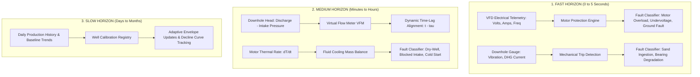

# Fluid Transit Dynamics & Predictive Model Management

## Executive Summary

In deep production wells and extensive gathering networks (with vertical depths of 2–6 km and extended-reach horizontal laterals or surface flowlines spanning 10–25+ km), physical fluid transit from the reservoir to surface measurement points incurs significant time delays (from minutes to several hours or days). 

This document explains the physical equations governing fluid arrival time, the separation between acoustic pressure wave propagation and physical mass transfer, and how the **CCED VFD Machine Learning & Diagnostic Engine** manages these transit delays across decoupled operational time horizons.

---

## 1. Physical Architecture of the Production System

```
  ┌────────────────────────────────────────────────────────────────────────┐
  │                           PRODUCTION SYSTEM                            │
  └────────────────────────────────────────────────────────────────────────┘
                                    │
                                    ▼
  1. RESERVOIR DYNAMICS (Inflow Delay: Hours to Days)
     • Pressure depletion, Inflow Performance Relationship (IPR)
     • Permeability drawdown and fluid recharge into the wellbore
                                    │
                                    ▼
  2. DOWNHOLE ESP PUMP (Instantaneous: Milliseconds to Seconds)
     • Submersible Motor, Intake/Discharge Gauges, VFD Drive
     • Sensors: Intake/Discharge Pressure, Motor/Intake Temp, Vibration, Current, Hz
                                    │
                                    ▼
  3. PRODUCTION TUBING (Transit Delay: Minutes to Hours)
     • Fluid column travel: 2,000 m to 6,000 m Measured Depth (MD)
     • Multiphase flow, gas expansion, fluid slippage
                                    │
                                    ▼
  4. SURFACE WELLHEAD & CHOKE (Hydraulic Interface)
     • Sensors: Wellhead Pressure (WHP), Annulus Pressure (AP), Choke %
                                    │
                                    ▼
  5. SURFACE FLOWLINE TO GATHERING FACILITY (Transit Delay: 2 to 12+ Hours)
     • Surface pipe networks: 5 km to 25+ km to central separator
     • Sensors: Flowline Pressure (FLP), Test Separator Flowmeter (BPD)
```

---

## 2. Mathematical Modeling of Fluid Arrival Time

### A. Volumetric Fluid Transit Equation
The transit time $t_{\text{transit}}$ required for oil and associated liquids to travel from the downhole ESP discharge through production tubing of length $L$ and internal diameter $D$ at a production rate $Q$ is given by:

$$t_{\text{transit}} = \frac{V_{\text{tubing}}}{Q} = \frac{\pi \cdot \left(\frac{D}{2}\right)^2 \cdot L}{Q}$$

#### Practical Example:
* **Tubing Length ($L$)**: $3{,}500\text{ m}$ ($11{,}483\text{ ft}$)
* **Internal Diameter ($D$)**: $2.875\text{ in} = 0.062\text{ m}$ ID
* **Tubing Volume ($V_{\text{tubing}}$)**: $\pi \times (0.031\text{ m})^2 \times 3{,}500\text{ m} \approx 10.56\text{ m}^3$ ($\approx 66.4\text{ bbl}$)
* **Production Rate ($Q$)**: $800\text{ BPD} \approx 5.30\text{ m}^3/\text{hr}$

$$t_{\text{transit}} = \frac{10.56\text{ m}^3}{5.30\text{ m}^3/\text{hr}} \approx 1.99\text{ hours (}\approx 120\text{ minutes)}$$

*For a 20 km surface flowline running at 1.0 m/s fluid velocity, an additional $5.5\text{ hours}$ of transport lag occurs before the fluid reaches the central processing separator.*

---

### B. Pressure Wave Propagation vs. Fluid Mass Transfer

A critical operational distinction is the difference between **acoustic pressure wave speed** and **fluid velocity**:

| Phenomenon | Speed / Latency | Physical Meaning | Impact on ML Models |
| :--- | :--- | :--- | :--- |
| **Acoustic Pressure Wave ($c$)** | $\approx 1{,}000 - 1{,}400\text{ m/s}$ (Arrival in **$2 - 4\text{ seconds}$**) | When ESP frequency increases, discharge pressure surge transmits rapidly through the continuous liquid column. | Wellhead pressure (WHP) and Flowline pressure (FLP) show immediate transient pressure response. |
| **Fluid Mass Transfer ($v_{\text{fluid}}$)** | $\approx 0.5 - 2.5\text{ m/s}$ (Arrival in **$1 - 12+\text{ hours}$**) | The actual physical crude oil molecules displaced from the reservoir reach the surface manifold. | Fluid property changes (water-cut shifts, sand slug, gas-oil ratio) exhibit long transport delays. |

---

## 3. Multi-Horizon Model Management Architecture

To prevent false alarms caused by transit delays (such as misidentifying the delay between a pump speed change and surface fluid arrival as a pipeline blockage or pump failure), our model architecture is organized into **three decoupled time horizons**:



---

## 4. Implementation Details in CCED VFD Models

### 1. Spatial Decoupling (Downhole vs. Surface Independence)
In [`models/normalization_layer.py`](file:///c:/Users/admin.DESKTOP-17T37DJ/OneDrive%20-%20TAS/Mahendra%20Singh%27s%20files%20-%20CCED%20VFD%20Details/code/models/normalization_layer.py) and [`models/fault_classifier.py`](file:///c:/Users/admin.DESKTOP-17T37DJ/OneDrive%20-%20TAS/Mahendra%20Singh%27s%20files%20-%20CCED%20VFD%20Details/code/models/fault_classifier.py), downhole pump health is evaluated directly at the downhole/drive interface without waiting for surface fluid delivery:
* **Differential Pressure ($\Delta P = P_{\text{disch}} - P_{\text{inp}}$)**: Confirms pump hydraulic head generation downhole.
* **Torque Proxy ($I / \text{Freq}$)**: Evaluates mechanical resistance and fluid load instantaneously at the motor shaft.
* **Thermal Rate ($\frac{dT}{dt}$)**: Evaluates heat dissipation to detect fluid presence across the motor shroud within 5-minute sampling windows.

### 2. Virtual Flow Metering (VFM)
Instead of waiting hours for oil to reach the test separator, the system uses pump affinity laws to estimate instantaneous downhole flow rate $Q_{\text{vfm}}$:

$$Q_{\text{vfm}} = Q_{\text{design}} \cdot \left(\frac{f}{f_{\text{design}}}\right) \cdot \eta\left(\Delta P, \mu\right)$$

This estimated rate predicts exact surface arrival time:

$$t_{\text{arrival}} = t_{\text{current}} + \frac{V_{\text{tubing}} + V_{\text{flowline}}}{Q_{\text{vfm}}}$$

### 3. Dynamic Time-Lag Cross-Correlation ($\tau$-Lag Buffering)
When comparing surface measurements (WHP, FLP) against downhole discharge pressure, features are aligned across a sliding time buffer:

$$\text{Surface\_Feature}(t) \longleftrightarrow \text{Downhole\_Feature}(t - \tau)$$

Where $\tau$ is computed from the well's calibrated transit time profile.

### 4. Well-Specific Calibration Registry
Because every well has unique depth, tubing diameter, water-cut, and reservoir pressure:
* [`WellCalibrationRegistry`](file:///c:/Users/admin.DESKTOP-17T37DJ/OneDrive%20-%20TAS/Mahendra%20Singh%27s%20files%20-%20CCED%20VFD%20Details/code/models/calibration_registry.py) maintains individual statistical envelopes ($P_{\text{min}}, P_{\text{max}}, I_{\text{median}}$) stored in [`well_calibration_registry.json`](file:///c:/Users/admin.DESKTOP-17T37DJ/OneDrive%20-%20TAS/Mahendra%20Singh%27s%20files%20-%20CCED%20VFD%20Details/code/models/well_calibration_registry.json) for all 73 field wells.
* Operational transitions (e.g., cold start, frequency ramp-up) employ transition timers to prevent false triggers during hydraulic fill-up periods.

---

## 5. Diagnostic Timescale Matrix

| Layer | Physical Phenomenon | Sensor Parameters | Evaluation Latency | Management Strategy |
| :--- | :--- | :--- | :--- | :--- |
| **Layer 1: Electrical** | Voltage sag, phase imbalance, motor overload, power loss | `Volt`, `VSD Amps`, `Frequency`, `Leak Current Ct` | **Instantaneous ($<1\text{ s}$)** | Direct boundary checks against drive limits. |
| **Layer 2: Mechanical** | Bearing wear, sand erosion, mechanical imbalance | `Vibration G's-Vx`, `DHG Current`, `Motor temp °C` | **Real-Time ($1 - 10\text{ s}$)** | Isolated Forest anomaly scoring & threshold triggers. |
| **Layer 3: Hydraulic** | Pump-off, blocked intake, scale wear, high backpressure | `Inp bar/psi`, `Disch pr. Bar/psi`, `WHP`, `FLP`, $\Delta P$ | **Minutes ($5 - 60\text{ mins}$)** | Differential head validation and $\tau$-lag correlation. |
| **Layer 4: Reservoir** | Fluid level drawdown, reservoir pressure decline, water-cut shifts | Intake pressure trend, Daily production volume | **Hours to Months** | Calibration envelope adaptation and moving baselines. |

---

## 6. Key Benefits of This Architecture

1. **Zero False Alarms on Startups & Speed Changes**: Decoupling downhole electrical diagnostics from surface flowline arrival prevents false "no-flow" alarms while the tubing column is filling.
2. **Immediate Equipment Protection**: Motor and pump mechanical trips occur within milliseconds regardless of well depth or pipeline distance.
3. **Proactive Flow Prediction**: Virtual Flow Metering provides upstream production insights hours before physical fluids reach separator tanks.
4. **Tailored Envelope Tracking**: Individual well envelopes adapt to varying well depths, tubing geometries, and geological families across all 73 wells.
