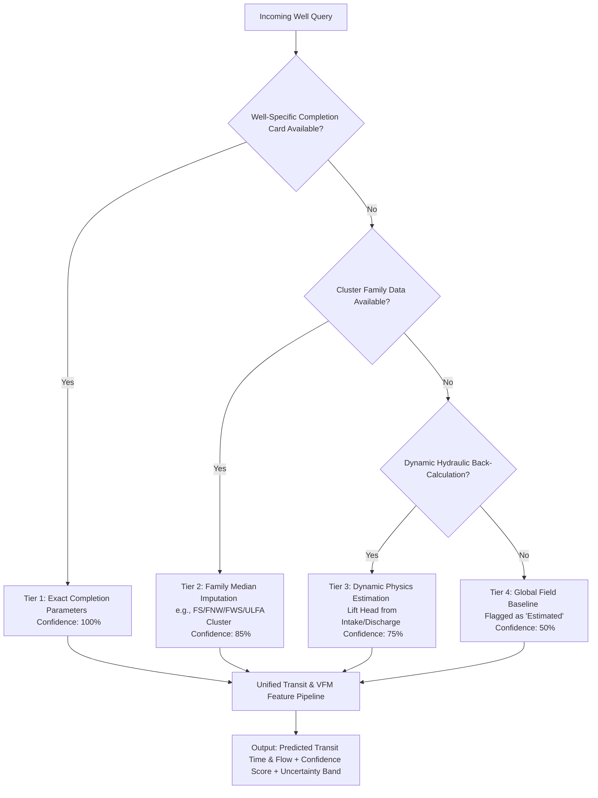

# Site Deployment & Fluid Transit Predictive Modeling: Master Implementation Plan

## Executive Summary & System Overview

This implementation plan establishes the architectural blueprint, data pipeline, machine learning design, and operational deployment strategy for integrating the **CCED VFD 13-Fault Diagnostic Engine**, the **Multi-Horizon Fluid Transit Predictor**, and the **Empirical Virtual Flow Metering (VFM)** system into the CCED on-premises field operations.

```
┌───────────────────────────────────────────────────────────────────────────────────────────────────────┐
│                                   ON-PREMISES FIELD OT CONTROL NETWORK                                │
├───────────────────────────────────────────────────────────────────────────────────────────────────────┤
│                                                                                                       │
│   [73 Well VFDs & Downhole Gauges] ───► [Multi-Protocol Gateway: OPC-UA / Modbus TCP / MQTT]          │
│                                                              │                                        │
│                                                              ▼                                        │
│                                           [Live Ingestion & Validation Buffer]                        │
│                                                              │                                        │
│                                    ┌─────────────────────────┴─────────────────────────┐              │
│                                    ▼                                                   ▼              │
│                      [Fast Electrical/Mechanical (0-5s)]                 [Medium Hydraulic (Mins-Hrs)]│
│                      • 13-Fault Classification Engine                    • Fluid Transit Lag Buffer   │
│                      • Isolation Forest Anomaly Detector                 • Empirical ML VFM Regressor │
│                                    │                                                   │              │
│                                    └─────────────────────────┬─────────────────────────┘              │
│                                                              │                                        │
│                                                              ▼                                        │
│                                            [Well Diagnostic Master Engine]                            │
│                                                              │                                        │
│                                    ┌─────────────────────────┴─────────────────────────┐              │
│                                    ▼                                                   ▼              │
│                      [SCADA Alarm Tag Write-Back]                        [Streamlit Field Dashboard]  │
│                      • Advisory Read-Only Alarm Flags                    • Live Telemetry Overlays    │
│                      • Operator Confirmation Queue                       • Operator Intelligence Card │
│                                                                                                       │
└───────────────────────────────────────────────────────────────────────────────────────────────────────┘
```

---

## 1. System Requirements & Design Decisions

| Architectural Dimension | Decision / Specification | Justification |
| :--- | :--- | :--- |
| **Telemetry Ingestion** | Multi-Protocol Ingestion Adapter supporting **OPC-UA/DA**, **Modbus TCP/RTU**, and **MQTT**. | Provides universal compatibility across legacy RTUs, modern VFD controllers, and central SCADA historians. |
| **Hosting Environment** | **On-Premises Central Field Server / SCADA Edge Workstation** (OT Network). | Zero cloud dependency; strictly compliant with industrial cybersecurity; provides sub-second inference latency. |
| **Flow Prediction (VFM)** | **Empirical Machine Learning Regressors (Gradient Boosted Trees / LSTM)** trained on historical well test separator records. | Captures non-linear multiphase flow dynamics, emulsion resistance, and wellhead chokes better than pure theoretical equations. |
| **Alerting Mode** | **Advisory Mode with SCADA Tag Write-Back & Operator Intelligence Cards**. | Prevents unauthorized automated shutdowns while providing field operators with instantaneous diagnostics and clear action steps. |
| **Data Quality & Fallbacks** | **Smart Data Science Multi-Tiered Hierarchical Imputation** with Confidence Scoring & Uncertainty Bands. | Ensures 100% operational uptime across all 73 wells even during partial completion data or sensor dropouts. |

---

## 2. Additional Site Data Requirements & Data Dictionary

While live telemetry streams 13 continuous sensors, full transit and VFM modeling requires the following completion and fluid parameters:

### A. Static Wellbore Geometry (`well_geometry_registry.json`)
```json
{
  "well_id": "FS-04",
  "cluster_family": "FS",
  "pump_setting_depth_md_m": 3250.0,
  "pump_setting_depth_tvd_m": 3100.0,
  "tubing_inner_diameter_in": 2.875,
  "casing_inner_diameter_in": 7.000,
  "surface_flowline_length_km": 8.4,
  "surface_flowline_inner_diameter_in": 4.026,
  "manifold_separator_id": "SEP-FS-01"
}
```

### B. Fluid PVT & Reservoir Baseline Properties
* **Crude Oil API Gravity**: 28°–36° API (converts pressure to hydraulic head).
* **Baseline Water Cut (% BS&W)**: Specific to well history (adjusts fluid mixture density).
* **Gas-Oil Ratio (GOR)**: Standard cubic feet per barrel (identifies gas breakout risk).
* **Historical Well Test Separator Logs**: Gross Liquid BPD, Net Oil BPD, Water Cut %, Test Date.

---

## 3. Data Science Architecture: Smart Missing Data & Fallback Strategy

To ensure robust data science best practices across all 73 wells:



---

## 4. Multi-Horizon Implementation Components

### Component 1: Multi-Protocol Telemetry Ingestion Bridge
* **`telemetry/multi_protocol_gateway.py`**:
  * `OpcUaAdapter`: Connects to Kepware / Matrikon / Siemens OPC-UA servers.
  * `ModbusTcpAdapter`: Polls standard Modbus register maps (holding registers 40001–40100) from ABB/Schneider/Novomet VFDs.
  * `MqttAdapter`: Subscribes to edge IoT topics (e.g. `cced/wells/{well_id}/telemetry`).
  * `DataSanitizer`: Strips non-physical noise, handles sensor flatlines, and feeds the normalization pipeline.

### Component 2: Fluid Transit & Lag Buffering Engine
* **`models/fluid_transit_engine.py`**:
  * Calculates volumetric tubing capacity $V_{\text{tubing}} = \pi (D/2)^2 L$.
  * Calculates surface flowline capacity $V_{\text{flowline}} = \pi (D_{\text{flow}}/2)^2 L_{\text{flow}}$.
  * Computes dynamic arrival time:
    $$t_{\text{arrival}} = t_{\text{current}} + \frac{V_{\text{tubing}} + V_{\text{flowline}}}{Q_{\text{vfm}}}$$
  * Manages the rolling $\tau$-lag time buffer for synchronized downhole-to-surface correlation.

### Component 3: Empirical ML Virtual Flow Metering (VFM)
* **`models/vfm_regressor.py`**:
  * Feature Vector: $[P_{\text{inp}}, P_{\text{disch}}, \Delta P, \text{Freq}, \text{Amps}, \text{Volt}, \text{Torque Proxy}, \text{WHP}, \text{FLP}, \text{Family}]$
  * Ensemble Model: LightGBM / XGBoost Regressor combined with temporal sequence lag features.
  * Outputs: Gross Liquid Rate (BPD), Net Oil Rate (BPD), Prediction Uncertainty ($\pm \text{BPD}$).

### Component 4: Unified Master Diagnostic Engine & SCADA Bridge
* **`models/diagnostic_engine.py`**:
  * Integrates Fast Horizon (0–5s) 13-Fault Diagnostics, Isolation Forest Anomaly Detection, Medium Horizon Fluid Transit Lag, and VFM.
  * Generates the **Operator Intelligence Card** with clear Root Cause and Remediation Steps.
  * Bridges to SCADA via OPC-UA/Modbus write-back for advisory alarm tag triggers.

### Component 5: Streamlit Field Operator Dashboard
* **`eda/dashboard.py`**:
  * Multi-well live monitoring panel with real-time transit status gauges ("Fluid In Transit", "Estimated Surface Arrival: 14:32:00").
  * Virtual Flow Meter vs. Separator Test validation graphs.
  * One-click PDF/CSV diagnostic shift reports for operations teams.

---

## 5. Verification & Validation Plan

### Phase 1: Unit & Physics Validation
* Verify volumetric transit calculations across extreme edge cases (zero flow, gas pocketing, cold start).
* Test multi-protocol adapters using simulated Modbus, OPC-UA, and MQTT test servers.

### Phase 2: Historical Replay & VFM Backtesting
* Replay 6 months of historical SCADA logs for all 73 wells through the gateway.
* Compare VFM flow predictions against historical physical well test separator reports (target: $R^2 \ge 0.88$, MAPE $\le 8.5\%$).

### Phase 3: Site Commissioning & Pilot Deployment
* Deploy on on-premises edge server in the CCED field control room.
* Connect to 5 pilot wells across different clusters (FS, FNW, FWS, ULFA).
* Run in parallel with existing SCADA alarms for 14 days in Advisory Mode to confirm zero false trips.
