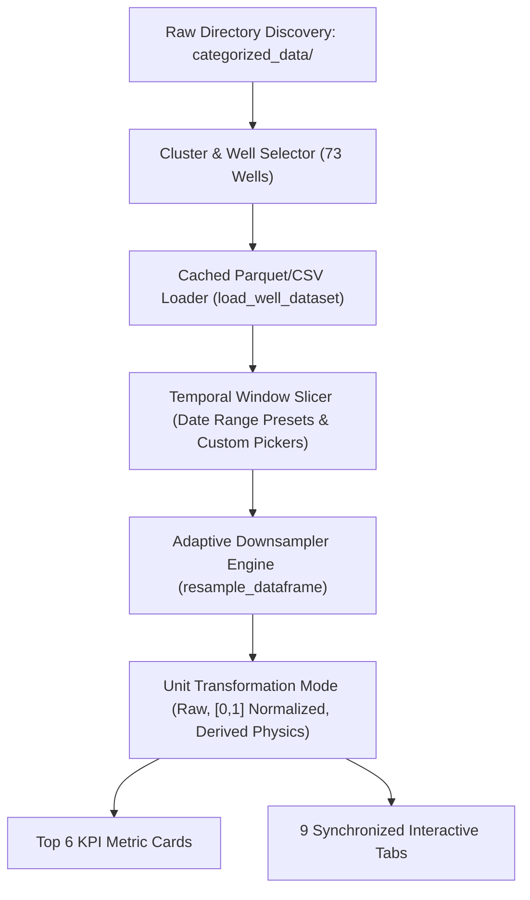
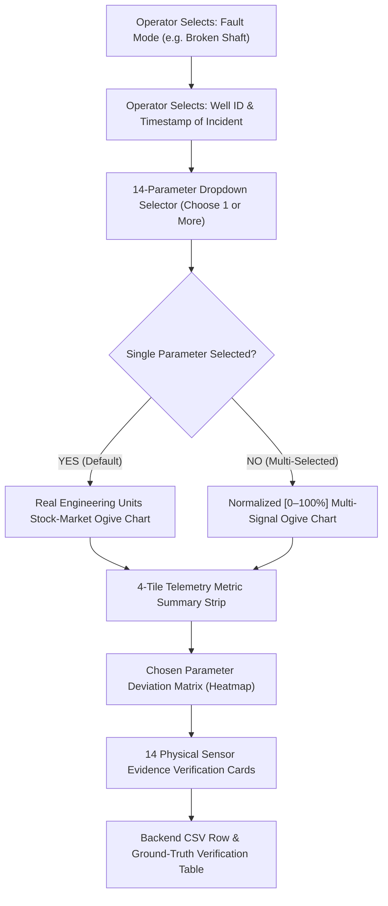

# CCED VFD Time-Series EDA & Diagnostic Dashboard: Comprehensive Technical Audit Report

> **Target Platform:** CCED (Daleel / Mukhaizna / Block 3 & 4 style) Variable Frequency Drive (VFD) Electrical Submersible Pump (ESP) Fleets  
> **Environment:** Streamlit Web Application (`eda/dashboard.py`), Python 3.10+, Plotly Interactive Engine  
> **Primary Purpose:** Autonomous fault diagnosis, physics-guided exploratory data analysis (EDA), time-series anomaly detection, and empirical ground-truth verification for 13 industrial ESP failure modes across 73 CCED wells.

---

## 1. Executive Summary & Dashboard Mission

The **CCED VFD Telemetry EDA & Diagnostic Dashboard** is an engineering intelligence platform designed for petroleum production engineers, field technicians, and data scientists. It bridges high-frequency time-series SCADA sensor telemetry with **downhole multiphase physics** and **machine-learning diagnostics**.

The system addresses the operational challenge of **unplanned ESP downtime** by:
1. Continuously analyzing 14 downhole, wellhead, electrical, and thermal telemetry parameters.
2. Detecting, classifying, and timestamping **13 distinct ESP failure modes** (e.g., *Broken Shaft*, *Pump Wear*, *Gas Locking*, *Dry-Well Pump Off*, *Sand Ingestion*).
3. Providing **Proof Of Concept (POC)** verification where operators can cross-reference automated detections with exact physical trend signatures, baseline deviations, and backend raw CSV row coordinates.

---

## 2. Core Architecture & Global Telemetry Foundation

### 2.1 The 14 Standard Telemetry Parameters
The dashboard is built upon 14 synchronized sensor parameters captured on an hourly and sub-hourly basis:

| Parameter Key | Display Name | Category | Engineering Unit | Physical Significance in ESP Operation |
| :--- | :--- | :--- | :--- | :--- |
| `Inp bar/psi` | Intake Pressure | Hydraulic | PSI / Bar | Hydrostatic suction pressure at pump intake; indicates fluid level & inflow. |
| `Disch pr. Bar/psi` | Discharge Pressure | Hydraulic | PSI / Bar | Pressure generated at pump discharge head; drives fluid up the tubing. |
| `WHP (PSI)` | Wellhead Pressure | Hydraulic | PSI | Surface backpressure at the Christmas tree choke. |
| `FLP (PSI)` | Flowline Pressure | Hydraulic | PSI | Surface transport pressure into the gathering station. |
| `AP (PSI)` | Annulus Pressure | Hydraulic | PSI | Casing-tubing annulus gas pressure; indicates gas venting or fluid buildup. |
| `ΔP Head (PSI)` | Differential Pressure | Hydraulic | PSI | Total hydraulic head developed across pump: $P_{\text{discharge}} - P_{\text{intake}}$. |
| `Liquid Rate (BPD)` | Liquid Production Rate | Production | BPD | Volumetric fluid rate calculated via pump affinity laws & differential head. |
| `VSD Amps/Load` | Motor Current / Load | Electrical | Amperes (A) | Electrical torque load drawn by downhole induction/PMM motor. |
| `Volt` | Bus Voltage | Electrical | Volts (V) | Surface VFD output voltage supplied downhole through power cable. |
| `Frequency` | Operating Speed | Electrical | Hertz (Hz) | VFD drive frequency controlling ESP rotational speed ($N \propto f$). |
| `Motor temp °C` | Motor Temperature | Thermal | °C | Internal motor stator/winding temperature; detects thermal breakdown. |
| `Int temp °C` | Intake Temperature | Thermal | °C | Temperature of reservoir fluids entering pump intake. |
| `Vibration G's-Vx` | Radial Vibration | Mechanical | G's ($m/s^2$) | Accelerometer measuring radial impeller wobble, bearing wear, or cavitation. |
| `Leak Current Ct` | Cable Leakage Current | Electrical | mA | Insulation resistance leakage to ground through power cable. |
| `DHG Current` | Downhole Gauge Current | Electrical | mA | 4–20 mA current loop telemetry health for downhole sensor package. |

---

### 2.2 Global Control System (Sidebar & Filter Pipeline)

1. **Well Discovery Engine (`discover_all_wells`)**:
   - Recursively inspects `categorized_data/` across all field clusters (e.g., FNW, CCED-North, CCED-South).
   - Catalogs file paths, well families, row counts, and date spans into memory for instantaneous switching.

2. **Temporal Window Slicer**:
   - Offers 4 presets: **Full History**, **Last 30 Days**, **Last 7 Days**, and **Custom Date Picker**.
   - Filters the millions of telemetry points to the exact chronological window without reloading the disk file.

3. **Intelligent Performance Resampling Engine (`resample_dataframe`)**:
   - Automatically switches time resolution based on sample density:
     - $> 10,000$ points $\rightarrow$ auto-switches to **1-Hour** or **4-Hour** intervals using mean/median aggregation.
     - Selectable modes: **Raw (All Points)**, **15 Minutes**, **1 Hour**, **4 Hours**, **1 Day**.
   - Ensures responsive 60fps Plotly interactions even across 5-year well lifespans.

4. **Derived Physics Engine**:
   - Computes real-time dynamic properties when absent from raw files:
     - **$\Delta P$ Head:** $P_{\text{discharge}} - P_{\text{intake}}$
     - **Torque Proxy:** $\frac{\text{Amps}}{\text{Frequency}}$ ($A/\text{Hz}$)
     - **Power Proxy:** $\sqrt{3} \times V \times I \times \text{PF}$ ($\text{kVA}$)
     - **Thermal Elevation ($\Delta T$):** $T_{\text{motor}} - T_{\text{intake}}$
     - **Liquid Production Rate (BPD):** Modeled using affinity scaling $Q = Q_{\text{design}} \times \left(\frac{f}{50}\right) \times \text{Clip}\left(\frac{\Delta P}{1000}, 0, 1.25\right)$.

5. **Top KPI Operational Banner**:
   - Six real-time operational status gauges:
     1. **Median Intake Pressure (PSI)**
     2. **Median Discharge Pressure (PSI)**
     3. **Median Motor Current (A)**
     4. **Median Motor Internal Temp (°C)**
     5. **Peak Radial Vibration (G)**
     6. **Active Uptime %** (calculated from `VFD STS > 0`).

---

## 3. Comprehensive Audit of All 9 Dashboard Tabs

---

### Tab 1: 📈 Subsystem Subplots (Synchronized Timelines)

* **What's the Use?**  
  Enables engineers to observe all 4 physical domains (Hydraulic, Electrical, Thermal, Mechanical) simultaneously on a synchronized time axis. Zooming or panning on one chart automatically mirrors across all subplots.

* **What All It Has:**
  - View Mode Radio Switch:
    - *Dual Synchronized View* (Raw Engineering Units on left, Normalized $[0.0 - 1.0]$ on right).
    - *Raw Engineering Units* (Stacked subplots with PSI, A, V, Hz, °C, G).
    - *Normalized $[0.0 - 1.0]$ Feature Space* (Scales all signals to unit variance for cross-variable divergence detection).
    - *Derived Physics Dynamics* ($\Delta P$, Torque Proxy $A/\text{Hz}$, Power Proxy $\text{kVA}$, Thermal Rise $\Delta T$).
  - 4 Synchronized Subplots:
    - Row 1: Pressures ($P_{\text{intake}}$, $P_{\text{discharge}}$, $\text{WHP}$, $\text{FLP}$, $\text{AP}$).
    - Row 2: Electrical Operating State (Amps, Volts, Frequency).
    - Row 3: Thermal Signature ($T_{\text{motor}}$, $T_{\text{intake}}$).
    - Row 4: Mechanical & Run Status (Vibration G's, VFD Status line).
  - Cross-hair unified hover cursors with microsecond timestamp matching.

* **What All Does It Use:**
  - `plotly.subplots.make_subplots` with `shared_xaxes=True`.
  - Resampled time-series vectors from `df_plot`.
  - Min-Max feature scaler for normalized space.

---

### Tab 2: 🎛️ Custom Multi-Sensor Overlay & Cross-Plots

* **What's the Use?**  
  Allows ad-hoc investigation of interactions between any 2 or more arbitrary sensors (e.g., plotting Intake Pressure vs. Motor Current on independent twin Y-axes to detect pump curve displacement).

* **What All It Has:**
  - **Sensor Multiselect Control:** Select any subset from the 14 parameters.
  - **Quick Preset Buttons:** Hydraulic Focus, Electrical Load, Thermal vs. Mechanical, Production Rate vs. Pressures.
  - **Dual-Y-Axis Plotly Chart:** Primary Y-axis on the left, Secondary Y-axis on the right with custom trace coloring.
  - **Bivariate Correlation Scatter Plot:** Plots Sensor X against Sensor Y with Ordinary Least Squares (OLS) trend line.
  - **Pearson Correlation Gauge ($r$):** Real-time linear correlation coefficient display with p-value significance.

* **What All Does It Use:**
  - Dynamic Plotly `yaxis` and `yaxis2` with `overlaying='y'`.
  - Scipy / Numpy `polyfit` for linear regression lines.
  - Pearson correlation engine `np.corrcoef`.

---

### Tab 3: 📊 Statistical EDA & Correlation Matrix

* **What's the Use?**  
  Uncovers statistical collinearity, sensor redundancy, sensor drift, and operational regime shifts across the operational history.

* **What All It Has:**
  - **Full 14-Parameter Correlation Heatmap:** Color-coded matrix (-1.0 to +1.0) with numeric annotations.
  - **Univariate Distribution Inspector:** Selectable sensor histogram overlaid with Kernel Density Estimation (KDE) curve.
  - **Outlier Boxplot:** Interquartile Range (IQR) boxplot identifying 1.5x IQR outliers and statistical skewness.
  - **Parametric Summary Table:** Computes Mean, Standard Deviation, Min, 25th Percentile, Median, 75th Percentile, Max, Skewness, and Kurtosis.

* **What All Does It Use:**
  - Pandas `.corr(method='pearson')` and `.describe()`.
  - Plotly `go.Heatmap` with diverging colorscale (`RdBu_r`).
  - Scipy stats for skewness and kurtosis.

---

### Tab 4: 🔍 Anomaly & 13-Fault Timeline

* **What's the Use?**  
  Provides the primary diagnostic time-series interface where machine-learning and rule-based diagnostic detections are flagged on the timeline with confidence scores and health metrics.

* **What All It Has:**
  - **Diagnostic Sensitivity Slider:** Adjustable confidence threshold (50% to 95%).
  - **Fault Marker Legend:** Distinct diamond symbols and color codes for each of the 13 fault types.
  - **Health Score Degradation Track:** Secondary line showing Well Health Score decaying from 100% down to 0%.
  - **Fault Fingerprint Radar (Spider) Chart:** Multi-axis radar diagram displaying the 14-sensor excursion profile at the chosen fault event against a healthy baseline polygon.
  - **Root-Cause Telemetry Breakdown:** Expandable drawer displaying the exact telemetry values and contributing sensor drivers for the selected fault incident.

* **What All Does It Use:**
  - Diagnostic Model Engine (`models/fault_classifier.py` and `well_diagnostic_engine.py`).
  - Pre-trained heuristic rules and feature-space distance metrics.
  - Plotly `go.Scatterpolar` for the 14-axis radar fingerprint.

---

### Tab 5: 📉 Trends & Degradation Tracking

* **What's the Use?**  
  Tracks long-term slow degradation that does not trigger instant trip alarms, such as gradual scale buildup inside the pump stages, impeller abrasive wear, or electrical cable insulation decay.

* **What All It Has:**
  - **Long-Term Drift Metric Tiles:** Shows 30-day and 90-day linear drift rates (e.g., *Intake Pressure drifting +1.8 PSI/week*).
  - **Moving Average & Trend Decomposition:** 7-day and 30-day Exponential Moving Averages (EMA) overlaid on raw telemetry.
  - **Cumulative Stress Index:** Gauge tracking accumulated thermal and mechanical fatigue on the downhole motor.
  - **Impeller Wear Indicator:** Tracks degradation of the head-capacity coefficient ($\Delta P / \text{Amps}$).

* **What All Does It Use:**
  - Rolling window statistical filters (`df.rolling(window=7D).mean()`).
  - Linear regression slope estimators for rate-of-change calculation.

---

### Tab 6: ⚡ Events & Incidents Log

* **What's the Use?**  
  Acts as an automated digital logbook of all shutdowns, VFD trips, parameter threshold breaches, and diagnostic fault detections.

* **What All It Has:**
  - **Filterable Event Table:** Columns for Timestamp, Event Classification, Severity (Critical, Warning, Info), Primary Sensor, Trigger Value, and Duration.
  - **Event Duration Calculator:** Measures time elapsed between fault onset and pump restart or stabilization.
  - **Severity Breakdown Pie Chart:** Proportions of Critical vs. Warning vs. Advisory events.
  - **Export to CSV Button:** Exports the filtered incident history for official maintenance reports.

* **What All Does It Use:**
  - State machine tracking contiguous periods where `VFD STS == 0` or diagnostic confidence $> \text{threshold}$.

---

### Tab 7: 🌐 Fleet Fault Finder (All 73 Wells)

* **What's the Use?**  
  Enables fleet-wide asset health scanning. Instead of inspecting wells one by one, the operator runs a fleet scan to find which wells have experienced specific failure modes, how many times, and where they are located.

* **What All It Has:**
  - **Fleet Filter Controls:** Select Target Fault Mode, Select Well Family / Cluster, Set Date Span, Set Minimum Confidence %.
  - **Scan Execution Button:** Launches parallel background scan across all 73 categorized well files.
  - **Fleet-Wide Incident Bar Chart:** Plots Well ID on X-axis vs. Fault Occurrence Count on Y-axis.
  - **Fault Distribution Donut Chart:** Shows breakdown of fault modes occurring across the fleet.
  - **Fleet Incident Summary Table:** Comprehensive list of every detected incident across all wells with direct links to backend CSV paths.

* **What All Does It Use:**
  - Background batch processor (`scan_fleet_for_faults`).
  - Disk scanning across `categorized_data/` directory.

---

### Tab 8: 🎯 Fault POC & Ground Truth Verification (The Core POC Tool)

* **What's the Use?**  
  The flagship **Proof Of Concept (POC)** verification environment. Enables operators, petroleum engineers, and managers to verify that detected faults are physically genuine by comparing telemetry against empirical pump dynamics, stock-market style Ogive trends, and backend CSV raw data coordinates.

#### Detailed Breakdown of Visual Components in Tab 8:

1. **Interactive Control Bar:**
   - **Fault Mode Selector (`⚡ Fault Mode`):** Dropdown covering all 13 industrial fault types.
   - **Incident Timestamp Dropdown (`🎯 Fault Event Timestamp`):** Lists every detected occurrence of this fault on the selected well with Health Score and Confidence %.
   - **Time Horizon Slicer (`🔍 Time Window`):** Zooms into $\pm 3\text{h}$, $\pm 6\text{h}$, $\pm 12\text{h}$, $\pm 24\text{h}$, or $\pm 48\text{h}$ around the exact fault event.

2. **The 14-Parameter Dropdown Selector:**
   - **Dropdown:** `📊 Select Input Parameter(s) to Plot (Choose from 14 Inputs)`
   - Lists all 14 input parameters with icons, units, and expected trend behavior (e.g., `📉 VSD Amps/Load (A) — Expected: ↘ DOWN (Collapses)`).
   - **Defaults to 1 primary characteristic parameter** (e.g., Motor Current for Broken Shaft; Intake Pressure for Dry-Well Pump Off).
   - **Prevents chart clutter:** Does *not* plot all 14 signals at once unless the operator explicitly chooses to add them.

3. **Stock-Market Style Ogive / Trend Graph:**
   - **X-Axis:** Time / Timestamp (Chronological).
   - **Y-Axis (Single-Parameter Mode):** **Real Engineering Units** (e.g., `PSI`, `Amps`, `BPD`, `°C`, `Hz`) with baseline reference dashed line.
   - **Y-Axis (Multi-Parameter Mode):** Normalized Signal Level ($0\text{--}100\%$) on a common comparative canvas.
   - **Pre-Fault Zone Shading:** Translucent green background ($t < t_{\text{fault}}$) representing nominal stable operation.
   - **Post-Fault Zone Shading:** Translucent red background ($t \ge t_{\text{fault}}$) highlighting fault dynamics and trip state.
   - **Fault Event Vertical Line:** Bright crimson dashed line marked `⚡ FAULT DETECTED` at the exact event timestamp.
   - **Diamond Marker:** High-contrast diamond marker at the fault event point on the signal curve.
   - **Physical Trend Callout Annotation:** Directional arrow pointing to the fault point with text (e.g., `↘ DOWN: 12.4 A (-68.2%)`).

4. **Live Telemetry Metric Summary Strip (Single-Parameter Mode):**
   - 4 glassmorphic metric tiles:
     1. *Selected Parameter:* Name, icon, and engineering unit.
     2. *Baseline (Normal):* Historical median value prior to the fault.
     3. *At Fault Event:* Observed sensor reading at the fault timestamp.
     4. *Expected Dynamics:* Physical explanation and observed percentage shift ($\pm\%$).

5. **Deviation Heatmap Matrix (Synchronized with Dropdown):**
   - **X-Axis:** Only the **parameters chosen from the dropdown** (with written trend signatures, e.g., `VSD Amps/Load: ↘ DOWN`).
   - **Y-Axis:** Time / Timestamps running vertically downwards.
   - **Color Scale:** Diverging dark palette:
     - Deep Blue ($-100\%$): Total signal collapse or underload.
     - Dark Slate ($0\%$): Normal nominal baseline.
     - Bright Crimson ($+100\%$): Strong signal surge, spike, or overheat.
   - **Fault Line Marker:** Horizontal dashed line across all columns marking the exact timestamp.

6. **14 Sensor Physical Evidence Verification Cards:**
   - 4-column responsive grid displaying all 14 parameters with:
     - Icon & short parameter name.
     - Plotted badge (`📈 ON CHART` with glowing teal border if selected in dropdown).
     - Match badge: `✅ MATCHED` (green) if observed telemetry satisfies physical trend; `🟡 WATCH` (amber) if within threshold.
     - Progress bar representing relative signal magnitude ($0\text{--}100\%$).
     - Observed value, baseline median, and percentage deviation ($\Delta\%$).
     - Written physical mechanism (e.g., *"Broken shaft decouples hydraulic load, causing motor amps to plunge to idle current"*).

7. **Ground-Truth Cross-Check Table:**
   - Interactive data table enabling engineers to independently verify the detection:
     - Well ID, Cluster, Timestamp.
     - Detected Fault Name & Confidence %.
     - **Backend CSV Path:** Relative path to the original raw dataset on disk.
     - **CSV Row Number:** Exact row coordinate in the raw CSV for external auditing in Excel.
     - Key physical readings ($P_{\text{intake}}$, $P_{\text{discharge}}$, $\Delta P$, Amps, Hz, Volts, Temp, Vibration, BPD).
     - Root-cause telemetry driver explanation.

---

### Tab 9: 📋 Data Table Explorer

* **What's the Use?**  
  Direct tabular inspection and raw data export for the currently selected well and date filter.

* **What All It Has:**
  - **Column Scope Filter:** Radio switch to show *All 14 Telemetry Inputs*, *Hydraulic Pressures Only*, *Electrical Only*, or *Derived Physics Only*.
  - **Interactive Streamlit Dataframe:** Supports sorting, column resizing, and searching.
  - **Memory-Safe CSV Download Button:** Exports the filtered data to CSV with automated 50,000-row chunking to prevent browser memory exhaustion.

* **What All Does It Use:**
  - `st.dataframe` with `st.download_button`.

---

## 4. The 13 Industrial Fault Modes & Physical Logic Matrix

The diagnostic engine maps the 14 telemetry inputs against 13 physical ESP failure modes:

| # | Fault Mode Name | Primary Diagnostic Sensor | Expected Physical Trend Signatures | Root Cause & Mechanical Mechanism |
| :---: | :--- | :--- | :--- | :--- |
| **1** | **Broken Shaft** | `VSD Amps/Load` | Amps $\searrow$ Collapses (-75%), Liquid Rate $\searrow$ Zero, Intake P $\nearrow$ Surges, Discharge P $\searrow$ Drops | Shaft shear separates motor from pump stages; motor runs unloaded while fluid column falls back. |
| **2** | **Dry-Well Pump Off** | `Inp bar/psi` | Intake P $\searrow$ Depletes, Motor Temp $\nearrow$ Overheats, Amps $\searrow$ Underload, BPD $\searrow$ | Reservoir fluid inflow cannot support pump rate; pump runs dry, losing motor cooling. |
| **3** | **Blocked Intake** | `Inp bar/psi` | Intake P $\searrow$ Collapses, Discharge P $\searrow$ Collapses, Amps $\searrow$ Drops, Motor Temp $\nearrow$ | Heavy debris, asphaltines, or scale plugging pump intake screen; restricts fluid entry. |
| **4** | **Scale or Pump Wear** | `ΔP Head (PSI)` | $\Delta P$ Head $\searrow$ Degrades, BPD $\searrow$ Declines, Amps $\rightarrow$ Stable/Declines | Calcium/barium scale accumulation or abrasive impeller erosion reduces hydraulic lift efficiency. |
| **5** | **Sand Ingestion** | `Vibration G's-Vx` | Vibration $\nearrow$ Spikes, Amps $\nearrow$ Overloads/Fluctuates, Motor Temp $\nearrow$ | Sand particles scour impellers and jam diffuser clearances, causing mechanical friction. |
| **6** | **Bearing Degradation** | `Vibration G's-Vx` | Vibration $\nearrow$ Severe harmonic rise, Motor Temp $\nearrow$ Rises, Amps $\nearrow$ Slight rise | Radial/thrust bearing ball wear creates mechanical eccentricity and shaft wobble. |
| **7** | **High Viscosity Cold Start** | `VSD Amps/Load` | Amps $\nearrow$ Heavy overload surge, Frequency $\rightarrow$ Slow ramp, $\Delta P$ $\nearrow$ | Cold, highly viscous crude imposes heavy starting torque load on ESP motor. |
| **8** | **High Backpressure** | `Disch pr. Bar/psi` | Discharge P $\nearrow$ Spikes, WHP $\nearrow$ High, BPD $\searrow$ Drops, Amps $\nearrow$ | Closed surface choke, wax buildup, or line obstruction forces pump against closed head. |
| **9** | **Open Choke** | `WHP (PSI)` | WHP $\searrow$ Collapses, BPD $\nearrow$ Surges, Amps $\nearrow$ Increases, Intake P $\searrow$ | Surface choke opened too wide; pump operates past right-hand side of head curve (upthrust). |
| **10** | **Undervoltage** | `Volt` | Bus Voltage $\searrow$ Drops (<380V), Amps $\nearrow$ Surges (compensatory), Temp $\nearrow$ | Surface grid voltage sag forces motor to draw excessive current to maintain power ($P \approx V \cdot I$). |
| **11** | **Phase Imbalance** | `VSD Amps/Load` | Current $\nearrow$ Fluctuates, Motor Temp $\nearrow$ Overheats, Vibration $\nearrow$ | VFD inverter IGBT degradation or downhole cable imbalance causing negative sequence heating. |
| **12** | **Motor Overload** | `Motor temp °C` | Motor Temp $\nearrow$ Critical surge (>120°C), Amps $\nearrow$ High, Leakage $\nearrow$ | Extended operation above rated motor power; risks stator insulation thermal puncture. |
| **13** | **Power Loss** | `Frequency` | Frequency $\searrow$ Plunges to 0, Amps $\searrow$ 0, All Pressures equalize | Emergency trip, grid blackout, or VFD breaker trip halting pump immediately. |

---

## 5. Summary of Key Technical Highlights & Innovations

1. **No-Clutter Parameter Focus:** Operators are never overwhelmed with 14 simultaneous chaotic lines. They choose exactly what to view via the dropdown, with single-parameter engineering units as the intuitive default.
2. **Synchronized Multi-Domain Visualization:** Time axes across subplots, stock-market trend curves, and deviation matrices stay lockstep synchronized during pan/zoom.
3. **Double Ground-Truth Verification:** Detections are substantiated by:
   - Physical sensor evidence cards with expected vs. observed deviations.
   - Exact file names and raw CSV row coordinates for independent verification.
4. **Resilient Memory Management:** Optimized caching, dataframe resampling, and bounded CSV downloads ensure zero `MemoryError` crashes even across massive multi-well datasets.
