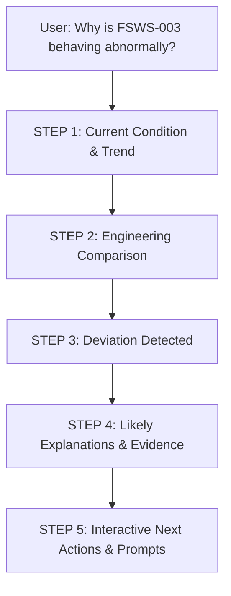

# Modal Diagnostic Response Specification (Tier 3: Deep Diagnostics)

This document establishes the canonical **5-Step Modal Diagnostic Response** pattern for the ESP Agentic Platform. 
This structure is strictly reserved for **Tier 3 (Full Diagnostic & Anomaly Analysis)** queries (e.g., *"Why is FSWS-003 behaving abnormally?"*, *"Diagnose trip on FS-031"*). 

General inquiries, greetings, definitions, and simple telemetry lookups bypass this template and receive direct answers.

---

## 1. End-to-End Diagnostic Trajectory

---

## 2. Step-by-Step Response Anatomy

### STEP 1 ── Current Condition & Trend
**Purpose:** Establish baseline reality using high-integrity, quality-gated telemetry.

* **Operating Frequency:** `48.0 Hz`
* **Motor Current:** `42.0 A` (Nameplate baseline: 65.0 A)
* **Intake Pressure (PIP):** Declining (`620 psi → 410 psi` over last 4h)
* **Production Rate:** Declining (`1,450 BPD → 980 BPD`)
* **Motor Temperature:** Increasing (`88°C → 114°C`, rate: +6.5°C/hr)

> **Visual Component:** `[Live / Historical Trend Chart]`
> Synchronized multi-axis time-series plot showing PIP, PDP, Frequency, Current, and Motor Temperature over the event window.

---

### STEP 2 ── Engineering Comparison (First Principles Physics)
**Purpose:** Compare real-time operating point against manufacturer equipment curves and affinity laws.

#### A. Pump Performance Curve (H-Q Curve at 48 Hz)
* **Expected Operating Region:** Best Efficiency Point (BEP) corridor: `1,600 – 1,900 BPD` at `4,200 ft TDH`
* **Current Operating Point:** `980 BPD` at `3,850 ft TDH` (operating far to the left of BEP)
* **Historical Operating Point (7-day baseline):** `1,720 BPD` at `4,180 ft TDH`

#### B. Motor Curve & Electrical Loading
* **Expected Motor Load:** `185 HP` (~82% nameplate loading at 48 Hz)
* **Actual Motor Load:** `118 HP` (~52% underloaded due to low fluid density / head loss)
* **Torque Proxy:** `0.875 A/Hz` (depressed from nominal `1.30 A/Hz`)

> **Visual Component:** `[Interactive Pump Head-Capacity Curve + Motor Load Curve]`
> Fused Plotly chart illustrating the manufacturer BEP envelope, head derating, and the operating trajectory migrating off-curve.

---

### STEP 3 ── Deviation Detected
**Purpose:** Quantify the divergence between physical reality and expected physics models via ML and rule gates.

* ⚠️ **Operating Point Migration:** Operating point has drifted **-42.3%** below the continuous flow envelope.
* ⚠️ **Motor Underloading:** Motor loading is **36.2% lower** than expected for 48 Hz operation.
* ⚠️ **Hydraulic Starvation:** Intake pressure falling continuously while motor winding temperature rises.
* ⚠️ **Production Drop:** Net fluid lift deficit of **-470 BPD** vs nominal.

> **Anomaly Model Gate:** `[Isolation Forest Anomaly: HIGH (Probability: 0.94)]`
> Cross-signal divergence flagged across hydraulic-electrical coupling.

---

### STEP 4 ── Likely Explanations (Ranked Hypotheses with Evidence)
**Purpose:** Surface multi-hypothesis root cause analysis ranked by evidence weight and causal graph matching.

#### 1. Gas Interference / Pump-Off (Primary Hypothesis — Confidence: 84%)
* **Evidence:**
  - Simultaneous decline in motor current (`42 A`) and intake pressure (`410 psi`).
  - Severe underloading on motor curve indicating multiphase gas entering pump stages.
  - Rising motor temperature (+6.5°C/hr) due to diminished fluid cooling flow past motor jacket.
* **Governing Rule / KB Ref:** SOP Section 4.2 (*"Gas Locking & Fluid Pound Signatures in ESPs"*).

#### 2. Reduced Well Inflow / Reservoir Drawdown (Secondary Hypothesis — Confidence: 62%)
* **Evidence:**
  - Sustained decline in pump intake pressure without sudden cyclic slugging.
  - Fluid level in annulus dropping toward pump intake perforation depth.
* **Governing Rule / KB Ref:** Inflow Performance Relationship (IPR) drawdown limits.

#### 3. Downhole Sensor / Measurement Calibration Issue (Alternative Hypothesis — Confidence: 18%)
* **Evidence:**
  - Wellhead surface pressure transmitter shows corresponding decline (counter-evidence: surface validates downhole gauge).
* **Governing Rule / KB Ref:** Sensor drift validation protocol.

---

### STEP 5 ── Interactive Next Actions & Operator Inquiries
**Purpose:** Human-in-the-loop empowerment. Offer immediate, context-aware actions and exploratory drill-downs.

The Agent explicitly prompts and accepts:

1. 🔘 **"Would you like me to compare this with the last 7 days?"**
   * *Action:* Loads 168-hour historical window from historian database to contrast current slope against baseline.
2. 🔘 **"Show me the evidence."**
   * *Action:* Displays detailed raw sensor audit table, calibration boundaries, and exact timestamped SCADA readings.
3. 🔘 **"Check whether this is consistent with gas locking."**
   * *Action:* Runs gas-interference cross-correlation test (FFT current ripple + PIP fluctuation variance).
4. 🔘 **"Show the expected operating point at 50 Hz."**
   * *Action:* Executes affinity law projection: Head $\propto (\frac{N_2}{N_1})^2$, Flow $\propto \frac{N_2}{N_1}$, Power $\propto (\frac{N_2}{N_1})^3$.

---

## 3. Tiering Rule Comparison

| Tier Level | Query Types | Data & Model Requirements | Response Structure |
| :--- | :--- | :--- | :--- |
| **Tier 1: General / KB** | *"what is an ESP?"*, *"good morning"*, *"who are you"* | Zero telemetry, zero physics, pure local LLM / KB lookup | 1–2 direct natural language paragraphs. No diagnostic cards. |
| **Tier 2: Asset Status** | *"What is FS-031 doing right now?"*, *"Show FS-010 specs"* | Asset Registry + 1-row latest telemetry snapshot | Concise key parameter readout & nameplate specs. |
| **Tier 3: Deep Diagnostics** | *"Why is FSWS-003 behaving abnormally?"*, *"Diagnose trip"* | Historical telemetry window + Pump curve + Motor curve + ML Anomaly + Ranked Hypotheses | **Full 5-Step Modal Diagnostic Response (Steps 1–5).** |
| **Tier 4: Operational History** | *"How many hours did FS-031 run in August?"*, *"Why did it stop?"* | Historian time-series analytics + Stop event logs | Computed exact totals, event segmentation, and downtime root cause. |
