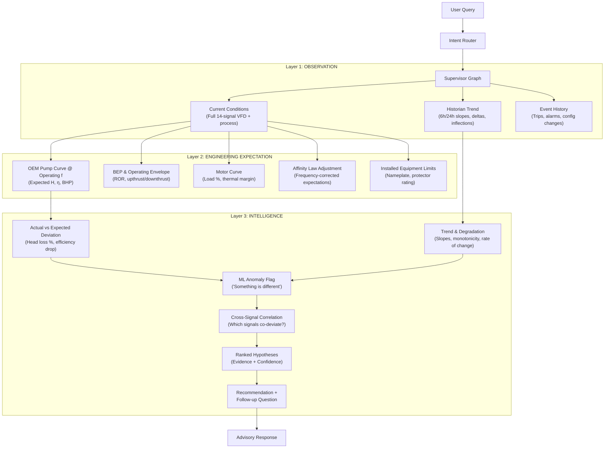

# Phase 1 — 3-Layer Agent Reasoning Architecture

**Goal:** Transform the ESP Agent from a single-snapshot, LLM-outsourced diagnosis system into a structured 3-layer reasoning engine where every diagnostic response follows: **Observation → Trend → Expected curve/model → Actual vs Expected deviation → Contributing parameters → ML anomaly → Ranked hypotheses → Evidence → Confidence → Recommendation → Follow-up question.**

**Core Principle (user-stated):**
> *"The ML anomaly model should NOT be the diagnosis. It should say 'Something is behaving differently.' The engineering layer should answer 'Different from what?' And the Agent should answer with expected vs observed + contributing parameters + ranked hypotheses."*

**Grounding:** This plan is built on three independent forensic audits of the codebase conducted 2026-09-04, covering every file in `code/models/`, `esp_agent/src/services/`, `esp_agent/src/agent/specialists/`, and `esp_agent/src/agent/supervisor/graph.py`. Every gap claim cites specific files and line numbers.

---

## User Review Required

> [!IMPORTANT]
> **OEM Pump Curve Data is the #1 External Dependency.** The entire Layer 2 (Engineering Expectation) depends on digitized pump performance curves for the fleet's actual installed pumps. Currently, only 2 hardcoded in-memory pump models exist (`D1450` and `DN1750` in [`oem_repository.py`](file:///x:/TAS/Agentic_project/esp_agent/src/services/engineering/oem_repository.py)). All 73 wells in [`asset_context_initial_seed_v2_rich.json`](file:///x:/TAS/Agentic_project/data/advait/asset_context_initial_seed_v2_rich.json) have `null` for `pump_curve_id`, `stage_count`, and `motor_rated_power_hp`. **Without digitized curve tables for the actual fleet pumps, the "Different from what?" answer is limited to the 2 hardcoded models or statistical baselines.**

> [!WARNING]
> **Phase 0 Prerequisites Still Open.** This plan assumes Phase 0.C (KB split-brain resolution) and the telemetry key mismatch fix are completed first. The 3-layer architecture cannot function if specialists silently consume hardcoded defaults due to key mismatches (`pip` vs `intake_pressure`). Phase 0.E (double `/api/ui` mount) is already fixed.

> [!IMPORTANT]
> **No Protector Curves or Motor Torque-Speed Curves Exist.** The user's spec includes "protector/loading curve" and "motor curve" as Layer 2 components. Zero protector data and only a single static motor nameplate (`M500`: 150 HP, 65A, 2150V) exist. Motor thermal derating, torque-speed, and protector thrust limits require OEM data that is not in the repository.

---

## Open Questions

> [!IMPORTANT]
> **Q1: OEM Curve Data Source.** Where are the digitized pump H-Q curves, motor performance curves, and protector load curves for the CCED fleet? The reference PDFs exist in [`esp-knowledge/sources/raw/oem/`](file:///x:/TAS/Agentic_project/esp-knowledge/sources/raw/oem/) but their tables have never been extracted into structured data. Should we:
> - (a) Extract curves from the existing PDFs into JSON/CSV?
> - (b) Use only the 2 existing hardcoded models (`D1450`, `DN1750`) for now and expand later?
> - (c) Build a generic parametric pump model from the calibration registry baselines?

> [!IMPORTANT]
> **Q2: Asset-to-Pump Mapping.** The 73 wells have no `pump_model_id` or `stage_count` populated. The engineering specialist currently hardcodes `pump_model_id="D1450"` and `stage_count=120` for every well. Should we:
> - (a) Populate the asset seed JSON with real equipment data from field records?
> - (b) Use a default mapping (e.g., all FS-cluster wells → D1450, all FNW → DN1750) until real data is available?

> [!IMPORTANT]
> **Q3: Historian Time Window for Agent Context.** The user's spec requires historian trends. The current database has ~3.3 days of data. What default lookback windows should the agent use?
> - Suggested: 6h (short-term), 24h (daily), and full-available (trend baseline).

> [!IMPORTANT]
> **Q4: Cross-Signal Correlation Training.** The IsolationForest in [`anomaly_detector.py`](file:///x:/TAS/Agentic_project/code/models/anomaly_detector.py) currently trains on synthetic 1D marginal samples (each sensor drawn independently). To detect true cross-signal correlation breakdowns (e.g., current rising while flow drops), it needs joint historical vectors from `normalized.db`. Should we retrain now (Phase 1) or defer to a dedicated ML improvement phase?

---

## Architecture Overview: The 3-Layer Reasoning Stack



---

## Current State vs. Target (Audit-Grounded Gap Matrix)

### Layer 1: OBSERVATION — "What is happening now?"

| Component | Target | Current State | File(s) | Gap Severity |
|---|---|---|---|---|
| **Full VFD telemetry in graph** | 14 VFD channels + process vars (flow, WC, gas) in `ctx["telemetry"]` | Only 7 snake_case signals with hardcoded inline fallbacks | [`graph.py:L487-495`](file:///x:/TAS/Agentic_project/esp_agent/src/agent/supervisor/graph.py#L487-L495) | **HIGH** |
| **Historian trend in graph** | 6h/24h statistical window (slopes, Δ, inflections) in `ctx["trends"]` | Historian REST API exists ([`historian_routes.py`](file:///x:/TAS/Agentic_project/cced_esp/backend/api/historian_routes.py)), tool exists ([`fetch_telemetry.py`](file:///x:/TAS/Agentic_project/esp_agent/src/tools/fetch_telemetry.py)), but **not registered in MCP, not called in graph** | [`tool_registry.py`](file:///x:/TAS/Agentic_project/esp_agent/src/mcp/tool_registry.py), [`graph.py`](file:///x:/TAS/Agentic_project/esp_agent/src/agent/supervisor/graph.py) | **CRITICAL** |
| **Event history in graph** | Recent trips, alarms, config changes in `ctx["events"]` | `DatabaseEventStore` exists ([`db_event_store.py`](file:///x:/TAS/Agentic_project/esp_agent/src/events/db_event_store.py)) with 12-type taxonomy, but **zero agent tools, zero graph nodes** | [`db_event_store.py`](file:///x:/TAS/Agentic_project/esp_agent/src/events/db_event_store.py) | **CRITICAL** |
| **Signal key alignment** | Unified key mapping across all layers | 3 incompatible naming conventions (VFD canonical, snake_case, specialist shorthand) | [`telemetry_service.py`](file:///x:/TAS/Agentic_project/esp_agent/src/services/telemetry_service.py), [`live_data_bridge.py`](file:///x:/TAS/Agentic_project/esp_agent/src/adapters/live_data_bridge.py), [`engineering.py`](file:///x:/TAS/Agentic_project/esp_agent/src/agent/specialists/engineering.py) | **CRITICAL** (Phase 0 prereq) |

### Layer 2: ENGINEERING EXPECTATION — "What should be happening?"

| Component | Target | Current State | File(s) | Gap Severity |
|---|---|---|---|---|
| **OEM pump curve lookup** | Interpolate H-Q-η at operating flow & frequency for the well's installed pump | 2 hardcoded models (`D1450`, `DN1750`); interpolation works but `B1` result **dropped from specialist output** | [`oem_repository.py`](file:///x:/TAS/Agentic_project/esp_agent/src/services/engineering/oem_repository.py), [`engineering.py:L57-62`](file:///x:/TAS/Agentic_project/esp_agent/src/agent/specialists/engineering.py#L57-L62) | **HIGH** |
| **Dynamic asset binding** | Specialist reads `pump_model_id`, `stage_count`, `motor_nameplate` from asset context | Hardcoded `D1450`, 120 stages, 65A for every well | [`engineering.py:L57-62`](file:///x:/TAS/Agentic_project/esp_agent/src/agent/specialists/engineering.py#L57-L62) | **HIGH** |
| **BEP & operating envelope** | Frequency-adjusted BEP and ROR from OEM curve | `A5` and `E1` calculations exist and work correctly in [`engine.py`](file:///x:/TAS/Agentic_project/esp_agent/src/services/engineering/engine.py); also a simpler ±15% BEP in [`engineering_service.py`](file:///x:/TAS/Agentic_project/esp_agent/src/services/engineering_service.py) | ✅ Exists (needs dynamic asset binding) | **LOW** |
| **Affinity law adjustment** | Scale Q, H, P from base 60 Hz to operating frequency | `A4` calculation fully implemented | [`engine.py`](file:///x:/TAS/Agentic_project/esp_agent/src/services/engineering/engine.py) | ✅ **EXISTS** |
| **Motor load calculation** | % load = I_measured / I_nameplate × 100 | `C2` calculation exists | [`engine.py`](file:///x:/TAS/Agentic_project/esp_agent/src/services/engineering/engine.py) | ✅ **EXISTS** |
| **Motor torque-speed curves** | Thermal derating, voltage-drop, load-efficiency curves | Only static nameplate (`M500`). No curves. | [`oem_repository.py`](file:///x:/TAS/Agentic_project/esp_agent/src/services/engineering/oem_repository.py) | **HIGH** (OEM data needed) |
| **Protector curves** | Thrust bearing load limits, HP losses | **Zero protector data in entire codebase** | — | **HIGH** (OEM data needed) |
| **Expected head at operating point** | H_expected from OEM curve at (Q, f) | `B1` interpolation exists in `oem_repository.py` but result is **never compared against actual H** | [`oem_repository.py`](file:///x:/TAS/Agentic_project/esp_agent/src/services/engineering/oem_repository.py) | **HIGH** |
| **Viscosity & gas corrections** | ANSI/HI 9.6.7 viscosity correction; free gas derating | Documented in YAML (`D1`, `D2`, `D3`) but **zero Python implementation** | [`engineering_calculation_registry.yaml`](file:///x:/TAS/Agentic_project/docs/engineering_registry/engineering_calculation_registry.yaml) | **MEDIUM** (defer) |

### Layer 3: INTELLIGENCE — "Why is it different and what does it mean?"

| Component | Target | Current State | File(s) | Gap Severity |
|---|---|---|---|---|
| **Actual vs Expected deviation** | H_actual vs H_expected, η_actual vs η_expected → % head loss, efficiency drop | `A1` computes actual TDH, `B1` computes OEM expected head, but **no calculation compares them** | [`engine.py`](file:///x:/TAS/Agentic_project/esp_agent/src/services/engineering/engine.py) | **CRITICAL** |
| **ML anomaly flag** | "Something is behaving differently" with calibrated probability | IsolationForest exists but trains on synthetic 1D marginals (no cross-correlation). `anomaly_score` faked in `live_data_bridge.py` as `1.0 - health_index/100` | [`anomaly_detector.py`](file:///x:/TAS/Agentic_project/code/models/anomaly_detector.py), [`live_data_bridge.py:L147`](file:///x:/TAS/Agentic_project/esp_agent/src/adapters/live_data_bridge.py#L147) | **HIGH** |
| **Trend & degradation** | Multi-horizon slopes (dY/dt), rolling averages, inflection detection | `query_historian.py` has basic stats (delta, slope, sparkline) but **never called by agent**. `cross_signal_correlation()` is an **explicit stub returning None** | [`query_historian.py:L174-184`](file:///x:/TAS/Agentic_project/esp_agent/query_historian.py#L174-L184) | **CRITICAL** |
| **Cross-signal correlation** | Detect co-deviation patterns (current↑ + flow↓ = pump wear) | **Explicit empty stub:** `return None` | [`query_historian.py:L174`](file:///x:/TAS/Agentic_project/esp_agent/query_historian.py#L174) | **HIGH** |
| **Hypothesis ranking** | Fuse L1 observations + L2 deviations + ML flags → ranked hypotheses with evidence & confidence | **100% outsourced to LLM prompt** or hardcoded mock in [`gateway.py`](file:///x:/TAS/Agentic_project/esp_agent/src/llm/gateway.py). Zero algorithmic pre-ranking. | [`gateway.py`](file:///x:/TAS/Agentic_project/esp_agent/src/llm/gateway.py) | **HIGH** |
| **Specialist execution quality** | Specialists analyze live data, not fixtures | `reliability.py` always injects hardcoded `R001: motor_temp=135 vs threshold=130`. `well_performance.py` hardcodes BEP=1750. Both fall back to fixture telemetry. | [`reliability.py:L49-66`](file:///x:/TAS/Agentic_project/esp_agent/src/agent/specialists/reliability.py#L49-L66), [`well_performance.py:L39-76`](file:///x:/TAS/Agentic_project/esp_agent/src/agent/specialists/well_performance.py#L39-L76) | **CRITICAL** |

---

## KPI Framework (9 Categories)

The user specified that the agent's reasoning must cover these KPI categories. Here is the mapping to existing code and gaps:

| KPI Category | Specific KPIs | Exists in Code? | Where / Gap |
|---|---|---|---|
| **Process** | Flow rate, intake/discharge pressure, wellhead pressure, flowline pressure, annulus pressure, water cut, GOR | **Partial.** 7 of ~20 signals reach the graph. Flow, WHP, FLP, AP, WC, gas are in the DB but not in `ctx["telemetry"]`. | Expand `data_quality_gate_node` |
| **Electrical** | Motor current, voltage, frequency, power factor, current/voltage imbalance, leakage current | **Partial.** Current, frequency, voltage reach graph. Imbalance, leakage, PF do not. | Expand `live_data_bridge.get_telemetry_as_agent_dict()` |
| **Hydraulic** | TDH, BEP deviation, pump efficiency, head/stage, hydraulic HP | **Partial.** TDH (`A1`) and BEP (`A5`) exist. Hydraulic HP (`A2`) exists. Pump η from curve (`B1`) exists but result dropped. | Wire `B1` results into specialist output |
| **Mechanical/Thermal** | Motor temp, intake temp, vibration, thermal margin, dT/dt | **Partial.** Motor temp and vibration reach graph. `dT/dt` exists in `normalization_layer.py` but not in graph context. Intake temp estimated thermodynamically. | Add thermal dynamics to context |
| **Control** | VFD status, operating frequency, frequency vs setpoint, ramp rate | **Partial.** VFD STS and frequency exist. No setpoint tracking or ramp rate calculation. | New: track frequency setpoint |
| **Derived** | Motor load %, operating region (upthrust/downthrust/optimal), drawdown, PI | **Partial.** `C2` (motor load) and `E1` (ROR) exist. Drawdown exists but PI hardcoded to `None`. | Wire existing calculations |
| **ML** | Anomaly probability, fault classification, health index, deviation from expected | **Partial.** IsolationForest anomaly exists. 13-fault classifier exists. Health index derived. **Expected-vs-actual deviation does NOT exist.** | New: `HEAD_DEVIATION` calc |
| **Event** | Trip count, trip frequency, last trip cause, alarm history, MTBF | **Partial.** `DatabaseEventStore` captures events. Zero agent-accessible queries. | New: event query tool |
| **Evidence** | Source provenance, KB citations, confidence decomposition, data freshness | **Good.** `EvidencePack`, `AdvisoryEvidenceItem`, provenance flags exist. But `collect_from_historian()` and `collect_from_knowledge_graph()` are dead collectors. | Wire dead collectors |

---

## Proposed Changes

### Phase 1.0 — Unified Telemetry Key Resolution (PREREQUISITE)

> [!CAUTION]
> This is the single highest-impact fix. Until this is done, **100% of specialist calculations silently use hardcoded defaults** because `tel.get("pip")` never matches the graph's `intake_pressure` key.

#### [MODIFY] [live_data_bridge.py](file:///x:/TAS/Agentic_project/esp_agent/src/adapters/live_data_bridge.py)
- Expand `get_telemetry_as_agent_dict()` from 7 signals to all 14 VFD channels + process variables (WHP, FLP, AP, water cut, VFD STS, leakage current, voltage imbalance, current imbalance, DHG current, intake temp).
- Return both snake_case canonical keys AND specialist shorthand aliases in a single dict (e.g., `{"intake_pressure": 350.0, "pip": 350.0}`).

#### [NEW] [telemetry_keys.py](file:///x:/TAS/Agentic_project/esp_agent/src/common/telemetry_keys.py)
- Single source of truth mapping: `CANONICAL_KEY → [all known aliases]`.
- `resolve(key, telemetry_dict) → value`: Tries canonical key first, then all aliases, returns `None` (never a silent default) if truly missing.
- Used by all specialists, graph nodes, and the engineering engine.

#### [MODIFY] [graph.py](file:///x:/TAS/Agentic_project/esp_agent/src/agent/supervisor/graph.py) — `data_quality_gate_node`
- Replace the 7-field hardcoded fallback dict (L487-495) with a full 14+ signal dict populated from `live_bridge.get_telemetry_as_agent_dict()`.
- Each signal gets a `_source` tag: `"live"`, `"registry_baseline"`, or `"unavailable"` — never a silent numeric default.

#### [MODIFY] Specialists: [engineering.py](file:///x:/TAS/Agentic_project/esp_agent/src/agent/specialists/engineering.py), [well_performance.py](file:///x:/TAS/Agentic_project/esp_agent/src/agent/specialists/well_performance.py), [reliability.py](file:///x:/TAS/Agentic_project/esp_agent/src/agent/specialists/reliability.py)
- Replace all `tel.get("pip", 350.0)`, `tel.get("pdp", 2100.0)`, `tel.get("current", 62.0)` with `resolve("intake_pressure", tel)`.
- Remove hardcoded rule `R001: motor_temp=135 vs threshold 130`. Instead, look up the well's actual threshold from `WellCalibrationRegistry` p90 or installed equipment rating.
- Remove hardcoded `bep_target = 1750.0`. Instead, read from asset context or OEM curve BEP.

---

### Phase 1.1 — Layer 1: Full Observation Context

#### [MODIFY] [tool_registry.py](file:///x:/TAS/Agentic_project/esp_agent/src/mcp/tool_registry.py)
- Register `get_history_window` tool (already implemented in [`fetch_telemetry.py`](file:///x:/TAS/Agentic_project/esp_agent/src/tools/fetch_telemetry.py)).
- Register new `get_event_history` tool.
- Add both to `OBJECTIVE_TOOL_ACL` for diagnostic objectives (`OP02`, `OP03`, `OP04`, `OP05`, `OP14`).

#### [NEW] [event_query_tool.py](file:///x:/TAS/Agentic_project/esp_agent/src/tools/event_query_tool.py)
- `get_event_history(asset_id, limit=20, event_types=None)` → wraps `DatabaseEventStore.list_events_by_asset()`.
- Returns structured event records: `[{event_type, timestamp, severity, payload_summary}]`.

#### [MODIFY] [graph.py](file:///x:/TAS/Agentic_project/esp_agent/src/agent/supervisor/graph.py) — `load_minimum_context_node`
- **Add historian trend loading** (for T3 diagnostic and T_HIST objectives only):
  ```
  ctx["trends"] = {
      "window_6h": get_history_window(asset_id, "6h", signals=critical_signals, aggregation="5m"),
      "window_24h": get_history_window(asset_id, "24h", signals=critical_signals, aggregation="15m"),
      "statistics": compute_trend_statistics(window_6h)  # slopes, deltas, inflections
  }
  ```
- **Add event history loading:**
  ```
  ctx["events"] = get_event_history(asset_id, limit=20)
  ```

#### [MODIFY] [context_builder.py](file:///x:/TAS/Agentic_project/esp_agent/src/services/evidence/context_builder.py)
- Wire `collect_from_historian()` into `build_evidence_pack()` (currently dead code — Plan.md Task 5.1).
- Add new `collect_from_events()` method to `EvidenceCollector`.

---

### Phase 1.2 — Layer 2: Engineering Expectation Context

#### [MODIFY] [engineering.py](file:///x:/TAS/Agentic_project/esp_agent/src/agent/specialists/engineering.py) — Dynamic Asset Binding
- Replace hardcoded equipment block (L57-62):
  ```python
  # BEFORE (hardcoded for every well):
  equipment = ESPEquipmentData(pump_model_id="D1450", stage_count=120, ...)
  
  # AFTER (dynamic from asset context):
  asset_ctx = state["context"].get("asset", {})
  equipment = ESPEquipmentData(
      pump_model_id=asset_ctx.get("pump_model_id", "D1450"),  # fallback to D1450 if null
      stage_count=asset_ctx.get("stage_count", 120),
      motor_nameplate_current_a=asset_ctx.get("motor_nameplate_current_a", 65.0),
      bep_flow_rate_bpd=asset_ctx.get("bep_flow_bpd", 1450.0),
  )
  ```
- Wire `B1` (pump curve head) and `F1` (current trend slope) results into the specialist output findings — currently **silently dropped** in `synthesize_engineering_findings_node`.

#### [NEW] [head_deviation.py](file:///x:/TAS/Agentic_project/esp_agent/src/services/engineering/head_deviation.py)
- **The "Different from what?" calculation.**
- Inputs: `H_actual` (from `A1`), `H_expected` (from `B1`), `η_expected` (from `B1` curve efficiency).
- Outputs:
  ```python
  {
      "head_loss_pct": (H_expected - H_actual) / H_expected * 100,
      "head_actual_ft": H_actual,
      "head_expected_ft": H_expected,
      "efficiency_expected_pct": η_expected,
      "operating_vs_bep_pct": operating_flow / bep_at_freq * 100,
      "interpretation": "DEGRADED" | "NORMAL" | "IMPROVED",
      "degradation_severity": "NONE" | "MILD" (<5%) | "MODERATE" (5-15%) | "SEVERE" (>15%)
  }
  ```
- Register as calculation `HD1` in the engineering calculation engine.

#### [MODIFY] [graph.py](file:///x:/TAS/Agentic_project/esp_agent/src/agent/supervisor/graph.py) — `load_minimum_context_node`
- Add `ctx["engineering"]["expected_vs_actual"]` populated from `head_deviation.py`.
- Add `ctx["engineering"]["pump_curve_point"]` with the full OEM curve interpolation at operating (Q, f).

---

### Phase 1.3 — Layer 3: Intelligence & Hypothesis Pre-Ranking

#### [NEW] [hypothesis_engine.py](file:///x:/TAS/Agentic_project/esp_agent/src/agent/reasoning/hypothesis_engine.py)
- **Algorithmic hypothesis pre-ranking BEFORE LLM synthesis.**
- Fuses evidence from all three layers:
  ```python
  class HypothesisEngine:
      def rank(self, observation: ObservationContext, 
               engineering: EngineeringContext, 
               ml_output: MLContext) -> List[RankedHypothesis]:
          """
          1. Collect candidate hypotheses from:
             - fault_classifier's scored faults (all with score >= 0.30, not just max)
             - engineering deviations (head loss -> pump wear/gas/scale)
             - trend anomalies (rising current -> motor degradation)
             - event correlations (recent trip -> post-restart behavior)
          
          2. For each hypothesis, compute evidence vector:
             - supporting_signals: which signals deviate in the expected direction
             - contradicting_signals: which signals DON'T match this hypothesis
             - engineering_match: does the expected-vs-actual pattern match?
             - trend_consistency: does the trend support onset timing?
             - event_correlation: does event history match?
          
          3. Score: weighted evidence for / (evidence for + evidence against)
          
          4. Return ranked list with:
             - cause: str
             - confidence: float (evidence-derived, not hardcoded)
             - supporting_evidence: List[EvidenceItem]
             - contradicting_evidence: List[EvidenceItem]
             - recommended_verification: str
          """
  ```

#### [MODIFY] [fault_classifier.py](file:///x:/TAS/Agentic_project/code/models/fault_classifier.py)
- **Return ALL scored faults** (not just `max`), each with its score and contributing signals.
- Current behavior: picks one winner. New behavior: returns `List[ScoredFault]` sorted by score, each with `{fault_name, score, contributing_signals: List[str], contradicting_signals: List[str]}`.
- This feeds the hypothesis engine with multiple candidates.

#### [MODIFY] [query_historian.py](file:///x:/TAS/Agentic_project/esp_agent/query_historian.py)
- Implement `cross_signal_correlation()` (currently `return None` stub):
  - Pearson correlation between signal pairs over the trend window.
  - Flag anti-correlations (current↑ + flow↓ = pump wear) and unexpected co-movements.
- Extract as importable module, not standalone script.

#### [MODIFY] [graph.py](file:///x:/TAS/Agentic_project/esp_agent/src/agent/supervisor/graph.py) — `generate_advisory_draft_node`
- Before LLM synthesis, run `HypothesisEngine.rank()` to produce pre-ranked hypotheses.
- Pass the ranked hypotheses into the LLM context as structured input (not raw specialist findings).
- The LLM's job becomes **narrative synthesis and follow-up question generation**, not hypothesis ranking.

---

### Phase 1.4 — Extended Advisory Payload

#### [MODIFY] [advisory.py](file:///x:/TAS/Agentic_project/esp_agent/src/schemas/advisory.py)
- Add the missing fields required by the 3-layer response pattern:

```python
class StandardAdvisoryPayload(BaseModel):
    # ... existing fields ...
    
    # NEW Layer 1 fields
    trend_summary: Optional[Dict[str, Any]] = Field(default=None, 
        description="6h/24h trend statistics: slopes, deltas, inflections per signal")
    event_summary: Optional[List[Dict]] = Field(default=None,
        description="Recent trips, alarms, config changes for the asset")
    
    # NEW Layer 2 fields
    expected_vs_actual: Optional[Dict[str, Any]] = Field(default=None,
        description="Engineering expectation: H_expected, H_actual, head_loss_pct, efficiency")
    operating_point: Optional[Dict[str, Any]] = Field(default=None,
        description="Current operating point on pump curve: Q, H, η, BEP%, ROR status")
    
    # NEW Layer 3 fields
    contributing_parameters: Optional[List[str]] = Field(default=None,
        description="Signals that contribute to the deviation pattern")
    ml_anomaly: Optional[Dict[str, Any]] = Field(default=None,
        description="ML anomaly flag: probability, is_anomaly, calibration source")
    ranked_hypotheses: Optional[List[Dict]] = Field(default=None,
        description="Pre-ranked hypotheses with evidence and confidence")
    uncertainties: Optional[List[str]] = Field(default=None,
        description="Explicit list of what the agent does NOT know or cannot verify")
    follow_up_question: Optional[str] = Field(default=None,
        description="Targeted follow-up question to narrow diagnosis")
```

---

### Phase 1.5 — Response Pattern Enforcement

#### [MODIFY] [user_entry.py](file:///x:/TAS/Agentic_project/esp_agent/src/agent/supervisor/user_entry.py) or [graph.py](file:///x:/TAS/Agentic_project/esp_agent/src/agent/supervisor/graph.py)
- For T3 diagnostic objectives, enforce the response follows the pattern:
  1. **Observation** → What is the current state? (from Layer 1)
  2. **Trend** → What has been changing? (from Layer 1 historian)
  3. **Expected** → What should be happening? (from Layer 2)
  4. **Deviation** → How does actual differ from expected? (from Layer 2 → Layer 3)
  5. **Contributing Parameters** → Which signals are driving the deviation? (Layer 3)
  6. **ML Anomaly** → Is this statistically unusual? (Layer 3)
  7. **Ranked Hypotheses** → What are the most likely causes? (Layer 3)
  8. **Evidence** → What data supports each hypothesis? (Layer 3)
  9. **Confidence** → How certain is each hypothesis? (Layer 3)
  10. **Recommendation** → What should the operator do? (Layer 3)
  11. **Follow-up** → What would narrow the diagnosis? (Layer 3)

- For T1/T2 objectives (KB lookup, simple status), this full chain is NOT required — short honest answers.

---

## Flagged Architectural Gaps (Cannot Be Resolved by Code Alone)

| Gap | Nature | Blocking? | Resolution Path |
|---|---|---|---|
| **OEM pump curve data for fleet** | No digitized curves for actual installed pumps (73 wells have `null` pump data) | **Yes, for true Layer 2** | Extract from OEM PDFs or populate from field records |
| **Motor performance curves** | Only static nameplate; no torque-speed, thermal derating | **No** (motor load % works from nameplate) | OEM data extraction (deferred) |
| **Protector curves** | Zero data | **No** (not blocking core diagnosis) | OEM data extraction (deferred) |
| **6-month historical data** | Only ~3.3 days in DB (Plan.md 0.A) | **Partially** (trend analysis works on available data but baseline quality limited) | Locate/ingest historical dataset |
| **Cross-signal IsolationForest** | Trains on independent 1D marginals, not joint distribution | **No** (anomaly flag still works, just less sensitive to correlation breaks) | Retrain on real joint vectors from `normalized.db` |

---

## Execution Order

```
Phase 1.0 (Telemetry Key Resolution)     ← PREREQUISITE, do first
    ↓
Phase 1.1 (Layer 1: Observation)  ∥  Phase 1.2 (Layer 2: Engineering)    ← parallel
    ↓                                    ↓
Phase 1.3 (Layer 3: Intelligence + Hypothesis Engine)    ← depends on both
    ↓
Phase 1.4 (Advisory Payload Extension)    ← depends on 1.3
    ↓
Phase 1.5 (Response Pattern Enforcement)  ← depends on 1.4
```

**Estimated file changes:**
- **New files:** 3 (`telemetry_keys.py`, `head_deviation.py`, `hypothesis_engine.py`, `event_query_tool.py`) = 4
- **Modified files:** 10 (`live_data_bridge.py`, `graph.py`, `tool_registry.py`, `context_builder.py`, `engineering.py`, `well_performance.py`, `reliability.py`, `fault_classifier.py`, `query_historian.py`, `advisory.py`)
- **Total:** 14 files

---

## Verification Plan

### Automated Tests
1. `pytest code/tests/test_figure_factory_forensics.py` — regression (existing, must still pass)
2. New: `pytest esp_agent/tests/test_telemetry_key_resolution.py` — verify `resolve()` maps all known aliases
3. New: `pytest esp_agent/tests/test_head_deviation.py` — verify H_actual vs H_expected calculation
4. New: `pytest esp_agent/tests/test_hypothesis_engine.py` — verify multi-hypothesis ranking with known fault patterns
5. New: `pytest esp_agent/tests/test_observation_context.py` — verify historian + events populate into graph state

### Manual Verification
1. **End-to-end diagnostic query:** Ask "What's wrong with FS-031?" → verify response contains all 11 elements of the pattern (observation through follow-up)
2. **Layer 2 verification:** For a well running at 45 Hz, verify the expected head is frequency-adjusted (not raw 60 Hz curve)
3. **Hypothesis ranking:** Inject a known "pump wear" signature (head loss + normal current + normal vibration) → verify "Scale or Pump Wear" ranks highest with correct evidence
4. **ML anomaly separation:** Verify the anomaly flag says "behaving differently" without claiming a specific cause — the engineering layer and hypothesis engine provide the cause

### Regression Gate
- All existing tests from Plan.md Phase 0.F harness must pass
- No specialist may silently consume a hardcoded telemetry value when live data is available
