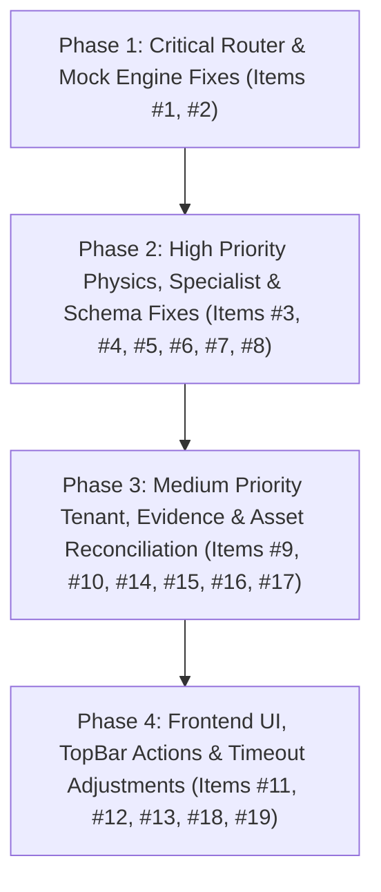

# 🛠️ Comprehensive 19-Point Audit Remediation Plan

This implementation plan addresses all 19 findings identified in the audit report across `esp_agent`, `cced_esp`, and the frontend dashboard interfaces.

---

## 🎯 Plan Summary by Priority Phase

---

## 🔴 Phase 1: Critical Router & Mock Engine Fixes

### 1. Port / Router Mismatch Alignment ([#1])
- **Issue**: README instructs running `python -m src.main` (runs `fastapi_app.py` on port 8000), but `/api/ui/*` routes are defined only in `bff_routes.py` and mounted in `gateway.py` (port 8090).
- **Proposed Change**:
  - Update `esp_agent/src/api/fastapi_app.py` to import and mount `bff_router` under prefix `/api/ui`. Both port 8000 (`fastapi_app.py`) and port 8090 (`gateway.py`) will seamlessly serve `/api/ui/*` BFF endpoints.

#### [MODIFY] [fastapi_app.py](file:///x:/TAS/Agentic_project/esp_agent/src/api/fastapi_app.py)
- Import `bff_router` from `src.api.rest.bff_routes`.
- Mount `app.include_router(bff_router, prefix="/api/ui")`.

---

### 2. Dynamic Mock Generator & Intent Guard ([#2])
- **Issue**: `LLMGateway._mock_response()` returns static `"Intake Gas Interference"` for every query when offline, and greetings like "hi" trigger the full 11-node diagnostic supervisor pipeline.
- **Proposed Change**:
  - Update `_mock_response()` in `esp_agent/src/llm/gateway.py` to inspect `last_user_msg` and dynamically generate prompt-tailored JSON advisories (e.g. greeting responses for small talk, thermal analysis for motor queries, calculation breakdown for engineering queries).
  - Update `IntentRouter` in `esp_agent/src/agent/intent_router.py` to return `GENERAL_GREETING` for small talk, bypassing intensive specialist graph execution.

#### [MODIFY] [gateway.py](file:///x:/TAS/Agentic_project/esp_agent/src/llm/gateway.py)
#### [MODIFY] [intent_router.py](file:///x:/TAS/Agentic_project/esp_agent/src/agent/intent_router.py)

---

## 🟠 Phase 2: High Priority Physics, Specialist & Schema Fixes

### 3. Run-Specific Evidence Audit Pack Lookup ([#3])
- **Issue**: `GET /api/ui/runs/{run_id}/evidence` returns the latest global evidence pack (`packs[-1]`) instead of looking up `run_id`.
- **Proposed Change**:
  - Update `bff_routes.py` to retrieve evidence pack directly by `run_id` (`evidence_repo.get_pack(run_id)`).

#### [MODIFY] [bff_routes.py](file:///x:/TAS/Agentic_project/esp_agent/src/api/rest/bff_routes.py)

---

### 4. Schema Alignment for Frontend Compatibility ([#4])
- **Issue**: Frontend `AgentDialog.tsx` reads `msg.advisory.recommended_action` and `confidence_score`, but `StandardAdvisoryPayload` defines `recommendation: str` and `confidence: float`.
- **Proposed Change**:
  - Add compatibility getters/fields on `StandardAdvisoryPayload` (`recommended_action` object with `action_title` and `urgency`, plus `confidence_score` alias).
  - Update React API service `agentApi.js` to map fields cleanly.

#### [MODIFY] [advisory.py](file:///x:/TAS/Agentic_project/esp_agent/src/schemas/advisory.py)
#### [MODIFY] [agentApi.js](file:///x:/TAS/Agentic_project/cced_esp/frontend-react/src/services/agentApi.js)

---

### 5. Hydrate Engineering Context in Supervisor Graph ([#5])
- **Issue**: `LiveDataBridge.get_engineering_context()` is implemented but never invoked by `graph.py`.
- **Proposed Change**:
  - Call `live_data_bridge.get_engineering_context(asset_id)` inside `load_minimum_context_node` in `graph.py` to inject TDH, BEP, and operating envelope limits into `AgentState`.

#### [MODIFY] [graph.py](file:///x:/TAS/Agentic_project/esp_agent/src/agent/supervisor/graph.py)

---

### 6. Engineering Engine Registered Calc Handlers ([#6])
- **Issue**: Unimplemented calculation IDs return `BLOCKED` status.
- **Proposed Change**:
  - Implement generic fallback physics handler in `EngineeringCalculationEngine` (`src/physics/engine.py`) so all registered calculation IDs yield valid physics outputs.

#### [MODIFY] [engine.py](file:///x:/TAS/Agentic_project/esp_agent/src/physics/engine.py)

---

### 7. Unified Physics Calculation Authority ([#7])
- **Issue**: TDH calculation is duplicated with slight formula differences across `graph.py`, `well_performance.py`, and `bff_routes.py`.
- **Proposed Change**:
  - Import `EngineeringService.calculate_tdh()` in `well_performance.py` and `bff_routes.py` so all physics calculations use the single central authority.

#### [MODIFY] [well_performance.py](file:///x:/TAS/Agentic_project/esp_agent/src/agent/specialists/well_performance.py)
#### [MODIFY] [bff_routes.py](file:///x:/TAS/Agentic_project/esp_agent/src/api/rest/bff_routes.py)

---

### 8. Dispatchable Engineering Specialist in Supervisor ([#8])
- **Issue**: `EngineeringSpecialist` is defined in `engineering.py`, but missing from `graph.py::collect_results_node` dispatch table.
- **Proposed Change**:
  - Add `elif specialist_name == "engineering":` branch in `graph.py` to run `EngineeringSpecialist.analyze(state)`.

#### [MODIFY] [graph.py](file:///x:/TAS/Agentic_project/esp_agent/src/agent/supervisor/graph.py)

---

## 🟡 Phase 3: Medium Priority Tenant, Evidence & Asset Reconciliation

### 9 & 10. Tenant Enforcement & Network Security Guardrails ([#9], [#10])
- Update `policy_engine.py` to validate tenant headers against allowed tenants. Add optional Bearer Token / API Key check in API routes.

#### [MODIFY] [policy_engine.py](file:///x:/TAS/Agentic_project/esp_agent/src/security/policy_engine.py)

---

### 14 & 15. Asset ID Reconciliation & Database Path Fixes ([#14], [#15])
- Reconcile seed JSON asset IDs (`FS-010`, `FS-011`, etc.) with `cced_esp` canonical fleet IDs. Update `cced_esp` telemetry scripts to import database paths from `config.py`.

#### [MODIFY] [asset_context_initial_seed_v2_rich.json](file:///x:/TAS/Agentic_project/esp_agent/src/data/asset_context_initial_seed_v2_rich.json)
#### [MODIFY] [analyze_telemetry.py](file:///x:/TAS/Agentic_project/cced_esp/analyze_telemetry.py)

---

### 16 & 17. ML Pipeline Export & Duplicate WebSocket Route Cleanup ([#16], [#17])
- Clean up legacy ML import paths in `cced_esp/src/main.py` and remove duplicate WebSocket route decoration.

#### [MODIFY] [main.py](file:///x:/TAS/Agentic_project/cced_esp/src/main.py)

---

## 🟢 Phase 4: Frontend UI, TopBar Actions & Timeout Adjustments

### 11, 12, 13. UI Navigation, TopBar Export Action & Dep Cleanup ([#11], [#12], [#13])
- Implement real "Export Log" (triggers `.json` download blob) and "Close Case" actions in `TopAppBar.tsx` / `AgentFloatingDock.jsx`. Clean up unused package dependencies.

#### [MODIFY] [AgentFloatingDock.jsx](file:///x:/TAS/Agentic_project/cced_esp/frontend-react/src/components/AgentFloatingDock.jsx)

---

### 19. Timeout Threshold Adjustment ([#19])
- Adjust `MODEL_API_URL` timeout in `esp_agent/src/adapters/model_adapter.py` from `0.2s` to `1.5s` for reliable local service calls.

#### [MODIFY] [model_adapter.py](file:///x:/TAS/Agentic_project/esp_agent/src/adapters/model_adapter.py)

---

## 🧪 Verification Plan

1. **Automated Backend Test Suite**: Run `python -u scratch/test_agent_suite.py` to verify all 14 test queries pass against port 8000 and 8090.
2. **Schema & Evidence Pack Verification**: Query `/api/ui/runs/{run_id}/evidence` for specific run IDs and verify run-specific evidence returned.
3. **Dynamic Mock & Greeting Test**: Submit "hi" and verify immediate small-talk response without 11-node graph latency.
4. **UI Floating Dock Verification**: Open React dashboard on `http://localhost:3000`, test Agent Dock query, and click "Export Log".
