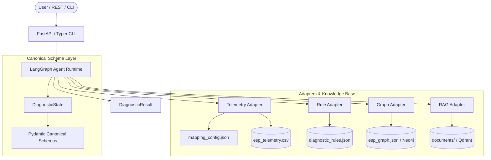

# Knowledge-Base-Agnostic ESP Diagnostic Agent

A production-ready, domain-agnostic backend diagnostic agent framework built with **LangGraph**, **Pydantic v2**, **FastAPI**, **Typer**, and universal adapters for Telemetry, Graph (Neo4j), Vector Documentation Search (Qdrant), and Deterministic Rules.

The agent runtime interacts exclusively with canonical concepts (`Asset`, `TelemetryMetric`, `ComponentNode`, `DiagnosticResult`). Transitioning to a new domain (e.g. Chillers, Wind Turbines, Compressors) or adapting to changed sensor field names requires zero code changes—only updating `metadata.json` and `mapping_config.json`.

---

## System Architecture



---

## Key Features

1. **Knowledge-Base-Agnostic Design**: Core runtime never references raw field names like `motor_temperature` or `intake_pressure`. All translation occurs dynamically via `mapping_config.json`.
2. **Deterministic Rules Engine**: Evaluates threshold breaches strictly using JSON rules, preventing LLM hallucination of operational limits.
3. **Multi-Source Evidence Integration**: Combines telemetry metrics, graph cause-effect relationships, rule violations, and documentation citations into a unified diagnosis.
4. **Dual-Mode Adapter Architecture**: Supports live external databases (Neo4j, Qdrant) while providing seamless embedded fallback for offline test environments.
5. **Read-Only Safety**: Diagnostic output only—no direct operational actions are triggered.

---

## Directory Structure

```
esp_agent/
├── .agents/
│   ├── agents.md
│   ├── skills/
│   └── workflows/
├── src/
│   ├── main.py
│   ├── agent/          # LangGraph runtime & state definitions
│   ├── schemas/        # Pydantic canonical & mapping schemas
│   ├── adapters/       # Universal adapters (Telemetry, Graph, RAG, Rules)
│   ├── tools/          # LangGraph tool functions
│   └── api/            # FastAPI app & Typer CLI
├── knowledge_bases/
│   └── esp/            # Electric Submersible Pump domain KB
│       ├── metadata.json
│       ├── mapping_config.json
│       ├── telemetry/
│       ├── graph/
│       ├── documents/
│       ├── rules/
│       └── test_scenarios/
├── tests/              # Comprehensive Pytest test suite
├── scripts/            # Telemetry dataset generator
├── requirements.txt
├── pyproject.toml
├── .env.example
├── README.md
└── docker-compose.yml
```

---

## Quick Start

### 1. Prerequisites & Environment Setup
Ensure Python 3.10+ is installed.

```bash
cd esp_agent
python -m venv venv
# On Windows:
venv\Scripts\activate
# On Linux/macOS:
source venv/bin/activate

pip install -r requirements.txt
```

### 2. Optional Docker Services (Neo4j & Qdrant)
To run external graph and vector database services:

```bash
docker-compose up -d
```

### 3. Generate Telemetry Data
Generate the 30-day simulated telemetry dataset:

```bash
python scripts/generate_telemetry.py
```

---

## Next.js Web UI Interface

A minimal white web UI with a simple header, sidebar, chat interface, diagnostic cards, and live chart visualization is included in `ui/`.

### Launching the Web UI

1. Start the FastAPI Backend:
   ```bash
   cd esp_agent
   python src/main.py
   ```

2. Start the Next.js Dev Server (in a new terminal):
   ```bash
   cd esp_agent/ui
   npm run dev
   ```

3. Open **`http://localhost:3000`** in your browser!

---

## CLI Usage

Run diagnostic scenarios directly from the command line:

```bash
# Validate Knowledge Base
python -m src.api.cli validate-kb

# Run Diagnostic Query
python -m src.api.cli run-diagnosis --asset-id ESP-Well-001 --query "ESP-Well-001 motor temperature is 140°C"

# Run All Test Scenarios
python -m src.api.cli run-tests
```

---

## REST API Usage

Start the FastAPI server:

```bash
python src/main.py
```
Server starts at `http://localhost:8000`. Interactive OpenAPI documentation is available at `http://localhost:8000/docs`.

### Key Endpoints

- `GET /health`: Health check and system metrics.
- `GET /knowledge-bases`: List registered knowledge bases.
- `POST /knowledge-bases/register`: Register a new knowledge base directory path.
- `POST /diagnose`: Run diagnosis on target asset.
- `GET /diagnose/{run_id}`: Retrieve diagnostic execution record.

#### Example API Request
```json
POST /diagnose
{
  "user_query": "ESP-Well-001 motor temperature is 140°C",
  "asset_id": "ESP-Well-001",
  "kb_id": "esp"
}
```

---

## How to Add a New Knowledge Base

To onboard a new domain (e.g. `chiller` or `wind_turbine`):

1. Create directory `knowledge_bases/<domain_id>/`.
2. Define `metadata.json` specifying assets and capabilities.
3. Define `mapping_config.json` mapping raw sensor names to canonical fields (`primary_thermal_metric`, `primary_intake_pressure`, etc.).
4. Add telemetry data (`telemetry/telemetry.csv`), topology graph (`graph/graph.json`), documentation (`documents/`), and diagnostic rules (`rules/diagnostic_rules.json`).
5. Register the new KB via REST API or CLI:
   ```bash
   curl -X POST "http://localhost:8000/knowledge-bases/register" -H "Content-Type: application/json" -d '{"kb_id": "chiller", "kb_path": "knowledge_bases/chiller"}'
   ```

---

## Running Tests

Execute the complete test suite:

```bash
pytest tests/ -v
```

All 8 core test scenarios are validated:
1. Normal operation test
2. Motor overheating test
3. Excessive vibration test
4. Low PIP test
5. Missing capability test
6. Renamed field names test
7. Unknown asset test
8. Missing telemetry test

---

## Troubleshooting Guide

- **Asset Not Found Error**: Verify that `asset_id` exists in `metadata.json` assets array.
- **Insufficient Telemetry Data**: Ensure `esp_telemetry.csv` has been generated by running `python scripts/generate_telemetry.py`.
- **Field Name Mismatch**: Check `mapping_config.json` to verify source field names match raw telemetry column headers exactly.
