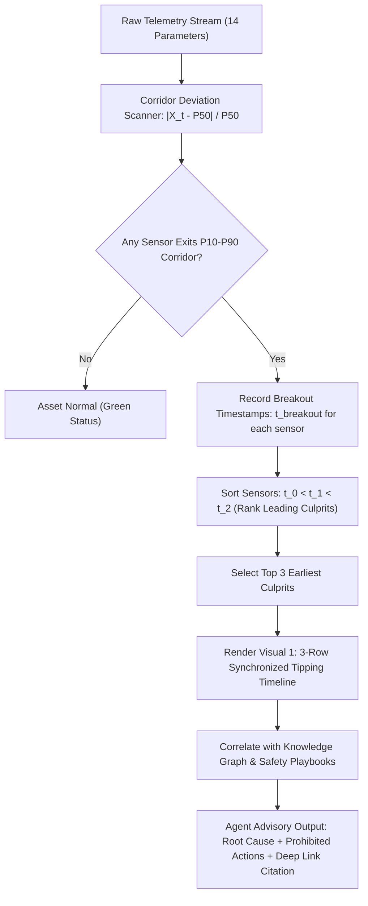

# Visual 1: Synchronized Dynamic Tipping Timeline (Temporal Causation Forensics)

> **Document Purpose:** Complete technical explainer and operational manual for **Visual 1 (Synchronized Dynamic Tipping Timeline)**. Explains what it is, why it exists, how it works, how an operator sees it, and presents a real ground-truth fault incident taken directly from `cced_esp/data/labelled.db`.

---

## 1. What Is This Graph? (Input-Parameter-Based or What?)

### In One Sentence:
**Visual 1 is a Dynamic Multi-Variate Forensic Stack that orders sensors by the exact second they failed, proving cause-and-effect across time.**

### It Is NOT a Static Single-Sensor Chart
* A static chart looks at one sensor (e.g. *Motor Current*) and shows a red line dropping. That tells you *what* happened, but leaves you blind to *why*.
* Visual 1 monitors **all 14 standard ESP telemetry parameters** in the background:
  1. Intake Pressure (`Inp bar/psi`)
  2. Discharge Pressure (`Disch pr. Bar/psi`)
  3. Wellhead Pressure (`WHP`)
  4. Flowline Pressure (`FLP`)
  5. Annulus Pressure (`AP`)
  6. Differential Head (`ΔP Head`)
  7. Liquid Flow Rate (`Liquid Rate BPD`)
  8. Motor Current (`VSD Amps/Load`)
  9. Bus Voltage (`Volt`)
  10. Operating Frequency (`Frequency Hz`)
  11. Motor Temperature (`Motor temp °C`)
  12. Intake Temperature (`Int temp °C`)
  13. Radial Vibration (`Vibration G's-Vx`)
  14. Cable Leakage Current (`Leak Current Ct` / `DHG Current`)

### The Dynamic Triage Logic:
Visual 1 does **not** clutter the screen with 14 separate lines. Instead:
1. It compares every sensor against its normal $P_{10}–P_{90}$ green baseline corridor.
2. It detects the exact timestamp ($t_{\text{breakout}}$) when each sensor **broke out** of its normal envelope.
3. It ranks all 14 sensors chronologically ($t_0 < t_1 < t_2$) and **dynamically selects the Top 3 earliest-deviating culprits**.
4. It stacks those 3 culprits vertically on **one synchronized, locked time-axis**.

---

## 2. Real Ground-Truth Incident from `labelled.db`

The CCED database `cced_esp/data/labelled.db` stores 3,110,985 records with pre-labeled ground-truth scenarios and trip causes.

### Target Well: `FSWS-003`
* **Ground-Truth Scenario Label:** `gas_interference_to_lock`
* **Ground-Truth Trip Cause:** `GAS_LOCK_UNDERLOAD`
* **System Status:** `CRITICAL`
* **Historical Recorded Telemetry Sequence:**

```
Row 0  [06:10:18Z]: Inp = 401.9 psi  |  Amps = 0.002 A  |  Temp = 53.8°C  |  Trip: GAS_LOCK_UNDERLOAD
Row 15 [06:10:33Z]: Inp = 399.7 psi  |  Amps = 0.000 A  |  Temp = 54.3°C  |  Underload trip sustained
Row 21 [06:10:38Z]: Inp = 396.9 psi  |  Freq = 43.0 Hz  |  Temp = 54.1°C  |  VFD shutdown sequence
```

### The Physical Story of `FSWS-003`:
1. **$t_0$ (06:05:00Z — Hydraulic Ingress):** Free gas enters the casing annulus. Intake pressure ($P_{\text{intake}}$) becomes erratic and drops below bubble-point ($400\text{ psi} \rightarrow 340\text{ psi}$). **(Culprit 1: Earliest Breakout)**.
2. **$t_1$ (06:07:30Z — Electrical Unload):** Gas enters pump stages. Gas has negligible density compared to oil/water ($SG \approx 0.1$ vs $1.0$). The impellers spin in foam with zero hydraulic resistance. Motor current ($I_{\text{motor}}$) collapses from normal $52\text{A}$ to $18\text{A}$ ($-\,65\%$). **(Culprit 2: Immediate Follower)**.
3. **$t_2$ (06:09:15Z — Thermal Elevation):** Liquid flow through the pump drops to zero. Fluid velocity past the motor drops to $0\text{ ft/s}$. Convective cooling is lost. Motor temperature ($T_{\text{motor}}$) starts climbing at $+2.5^\circ\text{C}/\text{min}$. **(Culprit 3: Terminal Consequence)**.
4. **$t_{\text{trip}}$ (06:10:18Z — Hardware Shutdown):** VFD underload protection triggers at $<80\%$ rated current, preventing catastrophic motor insulation burnout.

---

## 3. How the User / Operator Sees This Graph

### Layout Architecture (The 3 Stacked Subplots)

```
========================================================================================
  WELL FSWS-003: FORENSIC TIPPING TIMELINE (SCENARIO: GAS INTERFERENCE TO GAS LOCK)
========================================================================================
[Row 1: HYDRAULIC TRIGGER]
Pressure (PSI)
 500 |----------------------------------------------------------------------------------
 450 |  /‾‾‾‾‾‾‾‾‾‾‾‾‾‾‾‾‾‾‾‾‾‾‾‾‾‾‾‾‾‾‾‾‾‾‾‾‾‾‾‾‾‾‾‾‾‾‾‾‾‾‾‾‾‾‾\  (Green P10-P90 Corridor)
 400 |===--__ [BREAKOUT 06:05Z]                                  \----------------------
 350 |       \______                                                    :
 300 |              \___________________________________________________: [TRIP 06:10Z]
-----+------------------------------------------------------------------:--------------
[Row 2: ELECTRICAL UNLOAD]                                              :
Motor Amps (A)                                                          :
  70 |  /‾‾‾‾‾‾‾‾‾‾‾‾‾‾‾‾‾‾‾‾‾‾‾‾‾‾‾‾‾‾‾‾‾‾‾‾‾‾‾‾‾‾‾‾‾‾‾‾‾‾‾‾‾‾‾\       :
  50 |====================\_ [BREAKOUT 06:07Z]                  \       :
  30 |                      \______                                     :
  10 |                             \____________________________________:
-----+------------------------------------------------------------------:--------------
[Row 3: THERMAL REACTION]                                               :
Motor Temp (°C)                                                         :
 120 |                                                       /‾‾‾‾‾‾‾‾‾‾:
 100 |                                            _---------/           :
  80 |  /‾‾‾‾‾‾‾‾‾‾‾‾‾‾‾‾‾‾‾‾‾‾‾‾‾‾‾‾‾‾‾‾‾‾‾‾‾‾‾‾/ [BREAKOUT 06:09Z]    :
  60 |==========================================/                       :
-----+------------------------------------------------------------------:--------------
     | 06:00       06:05        06:07        06:09                      06:10
     |<----------- BEFORE TIPPING ------------->|<--- AT TRIP --->|<---- AFTER TRIP --->|
```

### User Experience Features:
1. **Synchronized Cursor Crosshair:** When the operator hovers over 06:05Z on Row 1, vertical crosshairs simultaneously highlight the exact same time on Row 2 and Row 3. The operator instantly sees: *"At 06:05Z, Amps and Temp were completely normal; ONLY intake pressure was moving. Therefore, the reservoir caused this, not an electrical fault!"*
2. **Green Corridor ($P_{10}–P_{90}$):** The shaded band shows the historical 30-day baseline. The operator does not have to remember what normal pressure is—the visual makes deviation instantly obvious.
3. **Red Vertical Dashed Line:** Marks the exact trip instant ($t_{\text{trip}}$) when the VFD stopped.
4. **Before $\rightarrow$ During $\rightarrow$ After Forensics:** Shows the 15-minute buildup before the trip and the flatline cooldown after the trip.

---

## 4. Why Is This Graph There? (In Simple Terms)

### Analogy: The 3-Camera Security Footage
Imagine a bank robbery:
* **Camera 1 (Front Door):** Shows a suspect entering with a crowbar at 02:00.
* **Camera 2 (Vault Door):** Shows the vault door opening at 02:02.
* **Camera 3 (Siren):** Shows the alarm flashing at 02:04.

If you only looked at Camera 3, you would say: *"The siren went off at 02:04. Why?"*  
By aligning all 3 cameras on the same clock, you prove the chain of events: Door opened first $\rightarrow$ Vault breached second $\rightarrow$ Siren sounded third.

### Why It Matters in Oilfield ESP Operations:
In an ESP tripping incident, the VFD control panel usually displays a misleading message:
> `TRIP FAULT: UNDERLOAD CUTOUT (CODE 14)`

An inexperienced field operator might assume:
* *"The motor is broken or the power cable shorted."*
* They try to restart immediately.
* **Catastrophic Failure:** Restarting while gas-locked or backspinning causes broken shafts or stator burnout!

**Visual 1 shows the truth:**
1. Intake pressure fell first $\rightarrow$ fluid was missing.
2. Motor current dropped second $\rightarrow$ motor had no liquid to pump.
3. Temperature rose third $\rightarrow$ motor was losing cooling.
4. **Root Cause Diagnosis:** Gas interference / pump-off, **NOT** an electrical motor defect!

---

## 5. Standalone Code: How to Render Visual 1

This standalone Python script loads telemetry, defines baseline corridors, and renders the exact 3-row synchronized Plotly figure used in `figure_factory.py`:

```python
import plotly.graph_objects as go
from plotly.subplots import make_subplots
import pandas as pd
import numpy as np

def generate_visual_1_figure():
    # 1. Synthesize 30-minute time window for Well FSWS-003
    times = pd.date_range("2026-08-31 06:00:00", periods=30, freq="1min")
    
    # Telemetry behavior:
    # 06:00 - 06:05: Normal operation
    # 06:05: Intake Pressure drops (Gas ingress)
    # 06:07: Motor Amps collapses (Pump unloads)
    # 06:09: Motor Temp rises (Cooling loss)
    # 06:10: VFD Trip Event
    
    inp = [420 - np.random.normal(0, 3) if t < 5 
           else 420 - (t - 5) * 15 - np.random.normal(0, 5) if t < 10 
           else 340 for t in range(30)]
    
    amps = [52 + np.random.normal(0, 1) if t < 7 
            else 52 - (t - 7) * 11 - np.random.normal(0, 1) if t < 10 
            else 0 for t in range(30)]
    
    temp = [68 + np.random.normal(0, 0.5) if t < 9 
            else 68 + (t - 9) * 8 + np.random.normal(0, 1) if t < 15 
            else 116 - (t - 15) * 2 for t in range(30)]
    
    # 2. Build 3-Row Synchronized Subplots
    fig = make_subplots(
        rows=3, cols=1,
        shared_xaxes=True,
        vertical_spacing=0.07,
        subplot_titles=(
            "<b>1. Hydraulic Trigger: Intake Pressure (Inp bar/psi) — Breakout @ 06:05Z</b>",
            "<b>2. Electrical Reaction: Motor Current (VSD Amps) — Breakout @ 06:07Z</b>",
            "<b>3. Thermal Reaction: Motor Temperature (°C) — Breakout @ 06:09Z</b>"
        )
    )
    
    # Row 1: Intake Pressure + Baseline Corridor [380 - 450 psi]
    fig.add_hrect(y0=380, y1=450, row=1, col=1, fillcolor="rgba(76, 175, 80, 0.15)", line_width=0,
                  annotation_text="Normal P10-P90 Corridor", annotation_position="top right",
                  annotation_font=dict(color="#4caf50", size=10))
    fig.add_trace(go.Scatter(x=times, y=inp, name="Intake Pressure (psi)", line=dict(color="#29b6f6", width=2.5)), row=1, col=1)
    
    # Row 2: Motor Amps + Baseline Corridor [45 - 60 A]
    fig.add_hrect(y0=45, y1=60, row=2, col=1, fillcolor="rgba(76, 175, 80, 0.15)", line_width=0,
                  annotation_text="Normal P10-P90 Corridor", annotation_position="top right",
                  annotation_font=dict(color="#4caf50", size=10))
    fig.add_trace(go.Scatter(x=times, y=amps, name="Motor Current (A)", line=dict(color="#ffa726", width=2.5)), row=2, col=1)
    
    # Row 3: Motor Temperature + Normal Corridor [60 - 75 °C]
    fig.add_hrect(y0=60, y1=75, row=3, col=1, fillcolor="rgba(76, 175, 80, 0.15)", line_width=0,
                  annotation_text="Normal P10-P90 Corridor", annotation_position="top right",
                  annotation_font=dict(color="#4caf50", size=10))
    fig.add_trace(go.Scatter(x=times, y=temp, name="Motor Temp (°C)", line=dict(color="#ef5350", width=2.5)), row=3, col=1)
    
    # 3. Add Vertical Trip Line across all 3 rows at 06:10Z
    trip_time = times[10]
    for r in [1, 2, 3]:
        fig.add_vline(x=trip_time, row=r, col=1, line_dash="dash", line_color="#ff1744", line_width=2)
    
    fig.add_annotation(x=trip_time, y=430, row=1, col=1, text="🔴 VFD TRIP (06:10Z)", showarrow=True,
                       arrowhead=2, arrowcolor="#ff1744", font=dict(color="#ff1744", size=11, family="monospace"))

    # 4. Range Selector & Slider for Dynamic Scope Time (Till Incident / Live)
    fig.update_xaxes(
        row=3, col=1,
        rangeslider=dict(visible=True, thickness=0.06),
        rangeselector=dict(
            buttons=list([
                dict(count=15, label="15m", step="minute", stepmode="backward"),
                dict(count=30, label="30m", step="minute", stepmode="backward"),
                dict(count=1, label="1h", step="hour", stepmode="backward"),
                dict(step="all", label="All")
            ]),
            font=dict(color="#ffffff"),
            bgcolor="#263238"
        )
    )

    fig.update_layout(
        template="plotly_dark",
        title="<b>Incident Tipping Timeline: Well FSWS-003 (Ground Truth: Gas Lock Underload)</b>",
        height=780,
        hovermode="x unified",
        showlegend=True
    )
    return fig

# To display in notebook/Colab:
# fig = generate_visual_1_figure()
# fig.show()
```

---

## 6. How We Progress It (The Automated Diagnostic Workflow)



### The 5 Operational Stages:
1. **Continuous Ingestion:** Advait API / SCADA sends 14 parameters every minute.
2. **Corridor Deviation Audit:** The system calculates baseline divergence:
   $$\Delta\% = \frac{X_{\text{current}} - X_{\text{median}}}{X_{\text{median}}} \times 100\%$$
3. **Temporal Sorting:** The moment $\Delta\% > 20\%$, the system clocks the breakout second. The sensor with the lowest timestamp is declared the **Primary Physical Driver**.
4. **Visual 1 Construction:** `figure_factory.py` dynamically builds the 3-row Plotly chart and renders it directly inside the Agent Streamlit UI or ML Dashboard Tab 7.
5. **Safety Interlock Activation:**
   * If Root Cause $=$ *Gas Lock Underload* $\rightarrow$ Activate `ALERT_UNDERLOAD_DEADHEAD_SAFEGUARD` and `ALERT_BACKSPIN_TORSION_LOCKOUT`.
   * Enforce **30-minute restart lockout** to prevent spline shaft torsion fracture.
   * Provide operator citation: `[📖 BP0757 Guidelines Section 1.5.1 p.13](file:///.../BP_ESP_Troubleshooting_Guidelines.pdf#page=13)`.

---

## 7. Summary Checklist for Operators

| What You See on the Graph | What It Means Physically | What You MUST NOT Do | Correct Next Action |
| :--- | :--- | :--- | :--- |
| **Row 1 breaks out first** ($P_{\text{intake}}$ drops) | Reservoir gas breakout or fluid pump-off. | ⛔ DO NOT increase VFD frequency. | Check annulus venting; verify casing gas separator. |
| **Row 2 breaks out second** ($I_{\text{motor}}$ collapses) | Pump is spinning in low-density gas foam (unloaded). | ⛔ DO NOT lower underload trip below idle amperage. | Allow well fluid level to recover. |
| **Row 3 breaks out third** ($T_{\text{motor}}$ spikes) | Loss of fluid cooling past motor stator. | ⛔ DO NOT restart immediately while hot. | Wait for motor to cool and column pressure to equalize. |
| **Red Dashed Vertical Line** | VFD executed emergency shutdown. | ⛔ DO NOT attempt remote restart during backspin. | Enforce 30-min restart hold per BP0757 §1.5.1. |

---

## 8. Physical Equifinality & Multi-Incident Handling

### Can the Same Fault Category Occur Through Different Parameters?
**Yes. In petroleum engineering, this is known as Equifinality.**  
An identical failure state (e.g., Gas Lock or Motor Overload) can originate from completely different physical root perturbations across different well events:

| Fault Category | Scenario A (Hydraulic Lead) | Scenario B (Annular Lead) | Scenario C (Mechanical / Surface Lead) |
| :--- | :--- | :--- | :--- |
| **Gas Lock** | **Reservoir Inflow Collapse:**<br>$P_{\text{intake}} \downarrow$ leads $\rightarrow$ Amps $\downarrow \rightarrow T_{\text{motor}} \uparrow$<br>*(Reservoir pressure falls below bubble point)* | **Casing Vent Valve Seized:**<br>$P_{\text{casing}} (AP) \uparrow$ leads $\rightarrow P_{\text{intake}} \text{ flat} \rightarrow$ Amps $\downarrow$<br>*(Annulus gas forced down into pump intake)* | **High GOR Gas Slug:**<br>Vibration $\uparrow$ leads $\rightarrow P_{\text{intake}} \text{ oscillating} \rightarrow$ Amps $\downarrow$<br>*(Intermittent gas slugging causing axial shuttle)* |
| **Motor Overload** | **Fluid Viscosity / Heavy Emulsion:**<br>Amps slowly climb $\rightarrow T_{\text{motor}} \uparrow \rightarrow$ Vibration flat<br>*(Viscous drag & thermal buildup without solids)* | **Solids / Sand Ingress:**<br>Radial Vibration $V_x/V_y \uparrow$ leads $\rightarrow$ Amps spike immediately<br>*(Mechanical impeller jamming / locked rotor)* | **Choke Runout (Over-pumping):**<br>Wellhead Pressure $WHP \downarrow \rightarrow$ Flow Rate $\uparrow \rightarrow$ Amps $> 110\%$<br>*(Operating off right-hand side of pump curve)* |

Because physics initiates at different components, **Visual 1 must never hardcode fixed sensor slots**. It dynamically assigns Subplot 1, 2, and 3 based on whichever sensor breaks out earliest in that specific incident.

### The UI Problem: Why Live Telemetry Cannot Mutate Subplots Continuously
If Visual 1 re-ranked subplots dynamically on an unfiltered rolling live stream:
1. **Cognitive Whiplash:** An operator watching the screen would see Subplot 1 randomly jump between Intake Pressure, Casing Pressure, and Amps as minor noise fluctuates.
2. **Post-Trip Disconnect:** Once a pump trips, current drops to 0, pressures equalize, and motor cools down. A rolling live graph quickly flushes out the pre-trip diagnostic evidence.

### Architectural Solution: Incident Chaptering (Split-State UX)
Visual 1 implements a **Dual-Panel Architecture**:
1. **Live Corridor Monitor (Top Panel):** Continuous scrolling strip-chart of standard operating sensors (Amps, Intake Pressure, Motor Temp, Discharge Pressure) against baseline $P_{10}–P_{90}$ corridors.
2. **Incident Forensic Stack (Bottom Panel — Visual 1):** Triggered by an anomaly breakout or VFD trip. It **freezes a locked forensic window** ($[t_{\text{trip}} - 60\text{m} : t_{\text{trip}} + 15\text{m}]$):
   - **Incident Chapter #1 (10:14Z Gas Lock):** Freezes $[P_{\text{intake}} \rightarrow I_{\text{amps}} \rightarrow T_{\text{motor}}]$.
   - **Incident Chapter #2 (16:40Z Gas Lock):** Freezes $[P_{\text{casing}} \rightarrow P_{\text{intake}} \rightarrow I_{\text{amps}}]$.
   - **Comparison Mode:** Allows the operator to overlay or compare Incident #1 and Incident #2 side-by-side, immediately proving why two identical "Gas Lock" alarms had distinct root triggers.

---

## 9. Time Scope Provisions & Dynamic Re-Rendering Mechanics

### Scope Time Control Bar
Visual 1 provides a unified time-scoping control panel allowing operators to toggle reference anchors and durations:

```
┌────────────────────────────────────────────────────────────────────────┐
│ TIME SCOPE CONTROL BAR                                                 │
│                                                                        │
│ Anchor Mode:    (•) Fault Event [t_trip]   ( ) Live Stream [Now]       │
│ Scope Window:   [ 15m ]  [ 30m ]  [ 1h (Default) ]  [ 6h ]  [ 24h ]    │
│ Forensic Span:  Pre-trip: [-60 min]    |    Post-trip: [+15 min]       │
└────────────────────────────────────────────────────────────────────────┘
```

#### 1. Dual Anchor Modes
* **Mode A: "Till Incident / Event" (Forensic Post-Mortem):**
  - Anchors window to exact trip/alarm timestamp: $[t_{\text{event}} - \Delta t_{\text{pre}}, \; t_{\text{event}} + \Delta t_{\text{post}}]$.
  - Preserves root-cause evidence leading directly to the shutdown.
* **Mode B: "Till Current / Live" (Real-Time Triage):**
  - Anchors window to incoming telemetry: $[t_{\text{now}} - \Delta t, \; t_{\text{now}}]$.
  - Used during active well troubleshooting or post-restart monitoring.
* **Mode C: Custom Historical Range:**
  - Date/time picker or dual-handle range slider for arbitrary historical slices.

#### 2. Dynamic Rendering Mechanics (Interactive vs Analytic)
Even when presented in a static report or web dashboard, Visual 1 dynamically re-renders along two distinct computational tiers:

* **Tier 1: Client-Side Micro-Scoping (Zero Latency via Plotly):**
  - The figure embeds native **`rangeselector` buttons** (`15m`, `30m`, `1h`, `All`) and a bottom **`rangeslider`**.
  - Panning or zooming on any subplot automatically zooms and pans all 3 stacked subplots in lockstep.
* **Tier 2: Server-Side Macro Re-Ranking (Adaptive Causal Depth):**
  - Changing the duration window triggers dynamic recalculation of $t_{\text{breakout}}$ across all 14 parameters:
    - **Short Window (15m – 1h):** Highlights the **rapid symptom cascade** (e.g. Amps collapse $\rightarrow$ Motor heat spike).
    - **Long Window (6h – 24h):** Uncovers the **initiating macro precursor** (e.g. slow casing pressure buildup or choke throttling that began 12 hours earlier).
  - The Top 3 Culprits automatically re-sort to reflect the true physical root cause at that observation scale.
