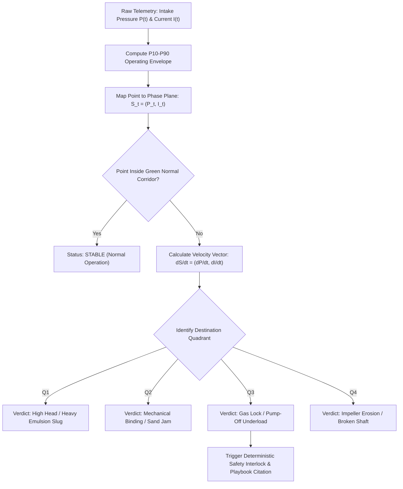

# Visual 2: Bivariate Operating Phase Plane ($I_{\text{motor}}$ vs. $P_{\text{intake}}$)
### *(The ESP Operational State-Space Radar)*

> **Document Purpose:** Complete technical explainer and operational manual for **Visual 2 (Bivariate Operating Phase Plane)**. Explains what it is, why it exists, how it works in state-space, how an operator sees it, and presents a real ground-truth fault incident taken directly from `cced_esp/data/labelled.db` (Well `FSWS-003`).

---

## 1. What Is This Graph in Simple Words?

### In One Sentence:
**Visual 2 is a GPS Flight Radar Map for the ESP that replaces the time axis with a 2D coordinate system, pinpointing the operating regime of the well in real time.**

### It Is NOT a Conventional Time-Series Chart
* In a time-series chart (like **Visual 1**), time is on the horizontal axis. You watch lines go up and down across minutes and hours. That shows *when* things happened.
* In **Visual 2 (Phase Plane)**, time is removed from the axis. Instead, we plot the two most fundamental physical forces of the pumping system against each other:
  1. **Horizontal Axis ($X$): Intake Pressure ($P_{\text{intake}}$ in psi)** $\rightarrow$ *The hydraulic energy and fluid supply supplied by the reservoir to the pump intake.*
  2. **Vertical Axis ($Y$): Motor Current ($I_{\text{motor}}$ in Amperes)** $\rightarrow$ *The electrical power drawn by the motor to lift that fluid column.*

Each minute of telemetry is plotted as a single $(X, Y)$ coordinate:
$$\mathbf{S}(t) = \big(P_{\text{intake}}(t), \; I_{\text{motor}}(t)\big)$$

Connecting consecutive points across time produces a **flight trajectory vector** that reveals the exact direction of machine health drift.

---

## 2. The 4 Diagnostic Quadrants (The Compass of ESP Physics)

The phase plane is divided into 4 physical operating quadrants centered around the well's historical baseline ($P_{10}–P_{90}$ normal envelope):

```
                       Motor Amps (Y-Axis)
                                ▲
                                │
            QUADRANT II         │         QUADRANT I
       [ MECHANICAL SAND JAM ]  │    [ HEAVY FLUID / EMULSION ]
        Low Pressure, High Amps │    High Pressure, High Amps
                                │
                                │     ┌──────────────┐
                                │     │  NORMAL ZONE │
      ──────────────────────────┼─────│ (Green Safe  │──────────► Intake Pressure
                                │     │   Circle)    │             (X-Axis)
                                │     └──────────────┘
            QUADRANT III        │         QUADRANT IV
        [ GAS LOCK / PUMP-OFF ] │    [ PUMP EROSION / SLIP ]
         Low Pressure, Low Amps │    High Pressure, Low Amps
                                │
                                │
```

### The Physical Laws of Each Quadrant:

| Quadrant | Coordinate Signature | Physical Interpretation | Field Root Causes |
| :--- | :--- | :--- | :--- |
| **Normal Zone (Green Ellipse)** | $P_{10} \le P \le P_{90}$<br>$I_{10} \le I \le I_{90}$ | **Balanced equilibrium.** Pump operating within manufacturer Best Efficiency Point (BEP). | Healthy steady-state production. |
| **Quadrant I (Top-Right)** | **High $P_{\text{intake}}$, High $I_{\text{motor}}$** | **Hydraulic overload.** Intake is flooded, but fluid is unusually heavy or downstream pressure is excessive. Motor draws high amperage to overcome hydrostatic head. | Heavy water cut emulsion, high-density fluid slug, or choked surface flowline valve. |
| **Quadrant II (Top-Left)** | **Low $P_{\text{intake}}$, High $I_{\text{motor}}$** | **Mechanical binding / friction lock.** Intake pressure is falling (less fluid), yet electrical power spikes. Motor is stalling against physical resistance. | **Solids / sand ingestion**, scale accumulation in pump stages, or bearing seizure. Accompanied by high radial vibration ($V_x$). |
| **Quadrant III (Bottom-Left)** | **Low $P_{\text{intake}}$, Low $I_{\text{motor}}$** | **Fluid starvation / vapor lock.** Intake pressure collapses below bubble point. Liquid is replaced by low-density gas foam. Impellers spin without load; motor current drops to idle. | **Gas Lock, Gas Interference, or Reservoir Pump-Off.** Annulus gas accumulation or drawdown exceeding reservoir inflow. |
| **Quadrant IV (Bottom-Right)** | **High $P_{\text{intake}}$, Low $I_{\text{motor}}$** | **Mechanical bypass / work loss.** Plenty of fluid energy at the intake, but the motor draws almost no power because the pump is failing to generate head. | **Internal stage wear / erosion**, sheared pump shaft, or VFD operating below minimum operating frequency. |

---

## 3. Real Ground-Truth Incident from `labelled.db`

Using historical ground truth from `cced_esp/data/labelled.db` (3.11M rows):

### Target Well: `FSWS-003`
* **Ground-Truth Scenario Label:** `gas_interference_to_lock`
* **Ground-Truth Trip Cause:** `GAS_LOCK_UNDERLOAD`
* **System Status:** `CRITICAL`

### The Trajectory of `FSWS-003` Across State Space:

```
Step 1 [06:00Z - Normal]:     (P_intake = 425 psi, Amps = 52.0 A)  -->  Inside Green Baseline Ellipse
Step 2 [06:04Z - Pre-Gas]:    (P_intake = 415 psi, Amps = 52.5 A)  -->  Drifting to left edge of corridor
Step 3 [06:05Z - Inflow Drop]:(P_intake = 340 psi, Amps = 48.0 A)  -->  Breaches left corridor wall
Step 4 [06:07Z - Gas Ingress]:(P_intake = 310 psi, Amps = 22.0 A)  -->  Plummets into Quadrant III
Step 5 [06:09Z - Full Lock]:  (P_intake = 260 psi, Amps = 12.0 A)  -->  Deep inside Gas Lock zone
Step 6 [06:10Z - VFD Trip]:   (P_intake = 250 psi, Amps =  0.0 A)  -->  Hits zero-current floor (Trip)
```

### Visual Representation of the Incident:

```
========================================================================================
   WELL FSWS-003: BIVARIATE OPERATING PHASE PLANE (CURRENT vs. INTAKE PRESSURE)
========================================================================================
 Motor Amps (A)
   80 |                                  
      |   [QUADRANT II: SAND JAM]       │   [QUADRANT I: HEAVY EMULSION]
   70 |                                 │
      |                                 │
   60 | - - - - - - - - - - - - - - - - ┼ - - - /‾‾‾‾‾‾‾‾‾\ - - - - - - - - - - - -
      |                                 │      /  NORMAL   \
   50 |                                 │     |   P10-P90   | ◄── (1) START (06:00Z)
      |                                 │      \   ZONE    /
   40 | - - - - - - - - - - - - - - - - ┼ - - - \_________/ - - - - - - - - - - - -
      |                                 │                 \
   30 |                                 │                  \ ◄── (2) DRIFT LEFT (06:05Z)
      |                                 │                   \
   20 |                                 │                    \
      |   [QUADRANT III: GAS LOCK]      │                     ▼ ◄── (3) DIVE (06:07Z)
   10 |                                 │                      \
      |                                 │                       ▼ ◄── (4) TRIP (06:10Z)
    0 +─────────────────────────────────┼────────────────────────X───────────────────────►
      0        100       200           300           400        500        600
                                                    Intake Pressure (PSI)
```

---

## 4. Why Do We Need Visual 2 When We Already Have Visual 1?

| Diagnostic Feature | Visual 1 (Synchronized Timeline) | Visual 2 (Bivariate Phase Plane) |
| :--- | :--- | :--- |
| **Domain** | Time Domain ($t$ on shared X-axis) | State-Space Domain ($P_{\text{intake}}$ vs $I_{\text{motor}}$) |
| **Core Question Answered** | *"When did it happen and which sensor broke out first?"* | *"What exact operational regime did the well enter?"* |
| **Cognitive Speed** | Operator must visually align 3 rows and compare breakout delays. | Operator looks at the dot's quadrant. **Quadrant III = Gas Lock.** Instant diagnosis. |
| **Cyclic Slugging Detection** | Appears as complex, overlapping sine waves across rows. | Appears as a **closed elliptical loop (limit cycle)**, immediately proving cyclic heading. |
| **Transient Insensitivity** | Shows every minor bump and dip along the timeline. | Filters high-frequency noise into a tight cluster, highlighting the net directional vector. |

---

## 5. Detecting Cyclic Slugging: Limit Cycles & Spirals

Not all failures are straight lines. Real well dynamics produce distinctive geometric shapes on the phase plane:

```
[ SHAPE 1: STRAIGHT DIVE ]         [ SHAPE 2: CLOSED LOOP ]          [ SHAPE 3: DOWNWARD SPIRAL ]
     ┌─────────────┐                    ┌─────────────┐                    ┌─────────────┐
     │   Normal    │                    │             │                    │   Normal    │
     └──────┬──────┘                    │     /───\   │                    └──────┬──────┘
            │                           │    │  O  │  │                           │
            ▼                           │     \───/   │                        (  @  )
     [Quadrant III]                     └─────────────┘                           │
  Sudden Gas Inflow Lock             Stable Cyclic Slugging              Progressive Well Pump-Off
```

1. **Straight Dive (Linear Failure):** Rapid gas breakout or emergency choke closure. Vector goes directly from center to outer quadrant.
2. **Closed Orbit / Limit Cycle (Heading / Cyclic Slugging):** The well cycles rhythmically between gas building up in the annulus, blowing through the pump, and clearing. The phase plane displays a continuous ellipse. The area of the loop indicates slug severity.
3. **Inward Spiral (Progressive Pump-Off):** The well produces slightly more liquid than the reservoir feeds. Each cycle operates at a slightly lower intake pressure until underload cut-off is breached.

---

## 6. Standalone Python Code: How to Render Visual 2

This standalone script generates the interactive Plotly Phase Plane with quadrants, baseline comfort zone, and the real trajectory of `FSWS-003`:

```python
import plotly.graph_objects as go
import numpy as np

def generate_visual_2_phase_plane():
    fig = go.Figure()

    # 1. Define Quadrant Shading & Annotations
    # X: Intake Pressure [0 - 600 psi], Y: Motor Amps [0 - 80 A]
    # Normal Center: P_intake = [380, 460], Amps = [45, 60]

    fig.add_annotation(x=150, y=72, text="<b>QUADRANT II<br>MECHANICAL SAND JAM</b><br>(Low P, High Amps)",
                       showarrow=False, font=dict(color="rgba(239, 83, 80, 0.45)", size=12))
    fig.add_annotation(x=520, y=72, text="<b>QUADRANT I<br>HEAVY FLUID / SLUGGING</b><br>(High P, High Amps)",
                       showarrow=False, font=dict(color="rgba(255, 167, 38, 0.45)", size=12))
    fig.add_annotation(x=150, y=15, text="<b>QUADRANT III<br>GAS LOCK / PUMP-OFF</b><br>(Low P, Low Amps)",
                       showarrow=False, font=dict(color="rgba(41, 182, 246, 0.45)", size=12))
    fig.add_annotation(x=520, y=15, text="<b>QUADRANT IV<br>STAGE WEAR / SLIPPAGE</b><br>(High P, Low Amps)",
                       showarrow=False, font=dict(color="rgba(171, 71, 188, 0.45)", size=12))

    # 2. Add Normal Operating Corridor (Green Box P10-P90)
    fig.add_shape(type="rect", x0=380, y0=45, x1=460, y1=60,
                  fillcolor="rgba(76, 175, 80, 0.20)", line=dict(color="#4caf50", width=2, dash="dot"))
    fig.add_annotation(x=420, y=52.5, text="<b>NORMAL BASELINE<br>P10-P90 ZONE</b>", showarrow=False,
                       font=dict(color="#81c784", size=10))

    # 3. Ground Truth Trajectory Points: FSWS-003 Gas Lock Incident
    p_intake = [425, 420, 418, 415, 380, 340, 310, 280, 260, 250]
    amps     = [ 52,  53,  51,  52,  48,  32,  22,  15,   5,   0]
    timestamps = [f"06:0{i}Z" for i in range(10)]

    # Draw continuous trajectory line with directional markers
    fig.add_trace(go.Scatter(
        x=p_intake, y=amps, mode="lines+markers+text",
        text=timestamps, textposition="top right",
        textfont=dict(color="#e0e0e0", size=9),
        line=dict(color="#ffa726", width=3),
        marker=dict(size=[7]*9 + [14], color=["#ffb74d"]*9 + ["#ff1744"],
                    symbol=["circle"]*9 + ["cross"]),
        name="Trajectory (FSWS-003)"
    ))

    # Add red trip callout annotation
    fig.add_annotation(x=250, y=0, text="🔴 TRIP: GAS LOCK UNDERLOAD (06:10Z)",
                       showarrow=True, arrowhead=2, arrowcolor="#ff1744",
                       font=dict(color="#ff1744", size=11, family="monospace"))

    # Layout configuration
    fig.update_layout(
        title="<b>Visual 2: Bivariate Operating Phase Plane (Motor Amps vs. Intake Pressure)</b><br>"
              "<sup>Well FSWS-003: Ground Truth Migration from Baseline into Gas Lock Quadrant III</sup>",
        xaxis=dict(title="<b>Pump Intake Pressure (psi)</b>", range=[0, 600], zeroline=True,
                   zerolinecolor="#455a64", gridcolor="#263238"),
        yaxis=dict(title="<b>Motor Current (VSD Amps)</b>", range=[-5, 85], zeroline=True,
                   zerolinecolor="#455a64", gridcolor="#263238"),
        template="plotly_dark",
        height=720,
        showlegend=True
    )
    return fig

# fig = generate_visual_2_phase_plane()
# fig.show()
```

---

## 7. How We Progress It (Automated Diagnostic Workflow)



---

## 8. Summary Checklist for Operators

When the operator opens Visual 2, they check the trajectory destination and follow this strict protocol:

| Trajectory Destination | Root Physical Diagnosis | Prohibited Action (DO NOT DO) | Mandatory Next Action |
| :--- | :--- | :--- | :--- |
| **Quadrant I**<br>(High $P$, High $I$) | Heavy fluid emulsion or downstream choke restriction. | ⛔ DO NOT increase motor frequency (will blow overload relay). | Open surface choke; sample wellhead fluids for emulsion/water cut. |
| **Quadrant II**<br>(Low $P$, High $I$) | Solids/sand jamming impellers or severe bearing drag. | ⛔ DO NOT attempt repeated remote VFD restarts. | Verify radial vibration $V_x/V_y$; flush tubing before restart. |
| **Quadrant III**<br>(Low $P$, Low $I$) | Gas lock, casing gas interference, or reservoir pump-off. | ⛔ DO NOT lower underload trip limit to keep pump running. | Open casing annulus vent; enforce 30-min backspin delay per BP0757 §1.5.1. |
| **Quadrant IV**<br>(High $P$, Low $I$) | Internal stage erosion, recirculation wear, or sheared shaft. | ⛔ DO NOT ramp up frequency to chase missing flow. | Perform hydraulic head check against factory $H-Q$ curve (Visual 3). |
