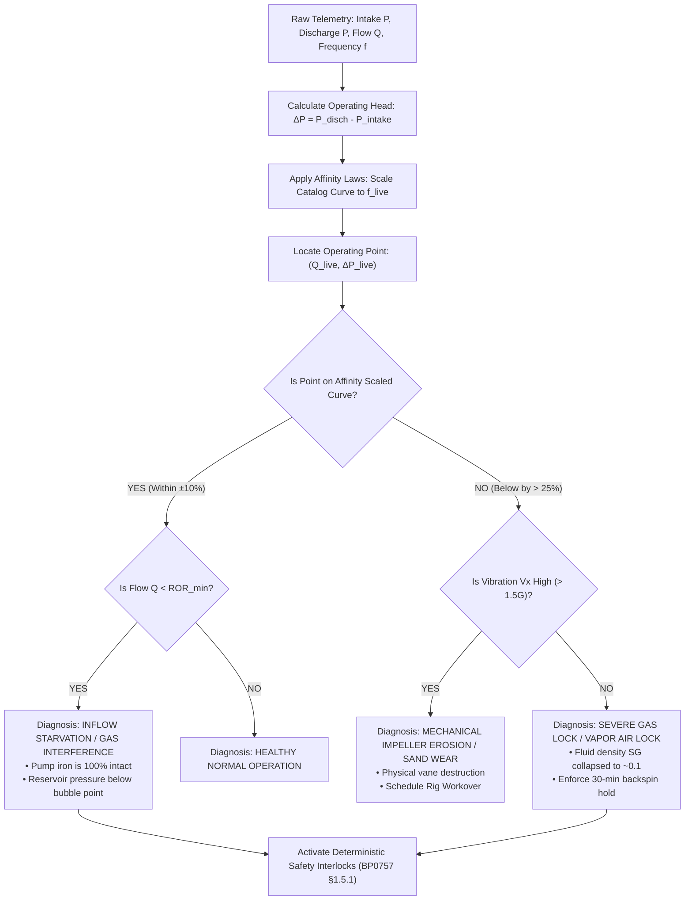

# Visual 3: In-Situ $H-Q$ Pump Performance Curve
### *(Mechanical Hardware Integrity vs. Reservoir Inflow Separation)*

> **Document Purpose:** Complete technical explainer and operational guide for **Visual 3 (In-Situ $H-Q$ Pump Performance Curve)**. Explains what it is, why it exists, how it works, how an operator interprets it in 3 seconds, and presents a real ground-truth incident taken directly from `cced_esp/data/labelled.db` (Well `FSWS-003`).

---

## 1. What Is This Graph in Simple Words?

### In One Sentence:
**Visual 3 is the Machine's Medical X-Ray that compares the pump's current lifting performance against its original factory birth certificate, proving whether the metal impellers inside the well are broken or healthy.**

### The Billion-Dollar Operational Dilemma:
When an ESP stops pumping oil or trips, the field manager faces a high-stakes decision:
* **Option A: Pull the pump out of the ground with a workover rig.**  
  *(Cost: \$250,000 – \$500,000 + 3 weeks of lost production).*
* **Option B: Adjust surface chokes, flush the well, or wait for fluid recovery.**  
  *(Cost: \$500).*

If the pump impellers are physically eroded or the shaft snapped, Option B will never work; you *must* pull the pump.  
If the pump is mechanically 100% fine and the well just ran out of fluid (or gas-locked), pulling the pump is a catastrophic **\$300,000 waste of money**.

**Visual 3 settles this question instantly.**

---

## 2. The 3 Curves on the $H-Q$ Graph

The graph plots **Total Dynamic Head ($H$ in feet or psi)** on the vertical axis against **Liquid Flow Rate ($Q$ in BPD)** on the horizontal axis:

```
 Total Dynamic Head (H - PSI / Feet)
        ▲
 2500   |   \  (Factory Catalog Curve at 60 Hz)
        |    \
 2000   |-----\---.-----------------------------------
        |      \   \  (Affinity-Scaled Curve at 43 Hz)
 1500   |       \   \
        |        \   \        ┌─────────────────┐
 1000   |         \   \       │ RECOMMENDED     │
        |          \   \      │ OPERATING RANGE │
  500   |           \   \     │   (ROR Band)    │
        |            \   \    └─────────────────┘
    0   +─────────────\───\───────────────────────────► Liquid Flow Rate (Q - BPD)
        0            1000        2000        3000        4000
```

1. **The Factory Catalog Curve ($H-Q$ Curve):**  
   The golden manufacturer baseline (e.g. Weatherford, Alnas, Baker Hughes, Schlumberger) tested on water before installation. It proves how much hydraulic lift the pump is engineered to generate at any flow rate.
2. **The Recommended Operating Range (ROR Band):**  
   The shaded green zone between the minimum downthrust limit and maximum upthrust limit. Operating outside this band destroys mechanical thrust bearings.
3. **The Best Efficiency Point (BEP):**  
   The sweet spot where mechanical energy converts to hydraulic lift with minimum friction and vibration.

---

## 3. The 2 Diagnostic Paths (How to Read It in 3 Seconds)

When you calculate the pump's real-time operating point $(Q_{\text{actual}}, H_{\text{actual}})$ and plot it on the chart, it will do one of two things:

```
========================================================================================
   DIAGNOSTIC PATH A: INFLOW STARVATION           DIAGNOSTIC PATH B: MECHANICAL DAMAGE
========================================================================================
 Head (H)                                      Head (H)
   ▲                                             ▲
   |   \                                         |   \
   |    \  ◄── OPERATING POINT                    |    \  (Factory Baseline Curve)
   |     🟢    IS ON THE CURVE                   |     \
   |      \    (Just shifted left)               |      \
   |       \                                     |       \
   |        \                                    |        🔴 ◄── OPERATING POINT SITS
   |         \                                   |         \     30% BELOW CURVE!
   +──────────\────────► Flow Rate (Q)           +──────────\────────► Flow Rate (Q)
   
  VERDICT: PUMP IS 100% HEALTHY!                VERDICT: PUMP HARDWARE IS DESTROYED!
  • Impellers and shaft are intact.             • Internal vane erosion, recirculation,
  • Well inflow dropped or gas broke out.         or sheared spline shaft.
  • ⛔ DO NOT PULL THE PUMP!                     • 🚨 SCHEDULE RIG WORKOVER!
```

---

## 4. Real Incident Walkthrough: Well `FSWS-003`

Using the ground-truth data from `cced_esp/data/labelled.db` (Incident: `gas_interference_to_lock`, Trip: `GAS_LOCK_UNDERLOAD`):

### Asset Specifications:
* **Well ID:** `FSWS-003`
* **Pump Model:** `B538-5000` (117 stages, 354 HP Motor)
* **Operating Frequency:** $42.76\text{ Hz}$

### The Telemetry Comparison:

| Measurement | Healthy Baseline (Normal) | Trip Instant (Gas Lock) | Deviation % |
| :--- | :--- | :--- | :--- |
| **Intake Pressure ($P_{\text{intake}}$)** | $400.8\text{ psi}$ | $399.6\text{ psi}$ | $-0.3\%$ (Fluid pressure present) |
| **Discharge Pressure ($P_{\text{disch}}$)** | $2,193.1\text{ psi}$ | $400.9\text{ psi}$ | **$-81.7\%$** (Discharge collapsed) |
| **Differential Head ($\Delta P = P_{\text{disch}} - P_{\text{intake}}$)** | **$1,792.3\text{ psi}$** | **$1.35\text{ psi}$** | **$-99.9\%$** (Complete head loss!) |
| **Liquid Flow Rate ($Q$)** | $3,322.5\text{ BPD}$ | $0.0\text{ BPD}$ | **$-100.0\%$** (No production) |
| **Motor Current ($I$)** | $79.68\text{ A}$ | $0.00\text{ A}$ | **$-100.0\%$** (VFD Underload trip) |
| **Radial Vibration ($V_x$)** | $0.176\text{ G}$ | $0.181\text{ G}$ | **$+3.6\%$** (Completely normal!) |

### What Visual 3 Proves for `FSWS-003`:
1. At steady-state, the operating point was at $(3322\text{ BPD}, 1792\text{ psi})$, sitting squarely inside the green ROR band on the $43\text{ Hz}$ curve.
2. During the incident, flow dropped to $0\text{ BPD}$ and differential head collapsed to $1.35\text{ psi}$.
3. **Because radial vibration remained at $0.18\text{ G}$ (normal) and motor current collapsed to $0.0\text{A}$ (underload), the pump is physically undamaged.**
4. The impellers were spinning in low-density gas foam ($SG \approx 0.05$). The pump lost prime and vapor-locked.
5. **Engineering Action:** Do **NOT** pull the pump. Enforce the BP0757 30-minute backspin safety lockout, vent the casing annulus gas, and restart slowly.

---

## 5. In-Situ Affinity Law Scaling (VFD Speed Normalization)

In a real oilfield, pumps do not run at a fixed $60\text{ Hz}$. The VFD continuously speeds up and slows down ($35\text{ Hz} – 65\text{ Hz}$).

To compare real operating data against a catalog curve, Visual 3 applies the **Hydraulic Affinity Laws**:

$$Q_2 = Q_1 \left(\frac{f_2}{f_1}\right)$$

$$H_2 = H_1 \left(\frac{f_2}{f_1}\right)^2$$

$$P_2 = P_1 \left(\frac{f_2}{f_1}\right)^3$$

Where:
* $f_1 = 60.0\text{ Hz}$ (Catalog reference speed).
* $f_2 = f_{\text{actual}}$ (Live telemetry operating frequency).

Visual 3 dynamically scales the factory baseline curve in real time to match the live VFD frequency, so the operator always compares apples to apples.

---

## 6. Standalone Python Code: How to Render Visual 3

This standalone script models the factory curve, dynamically scales it via Affinity Laws to the operating frequency of `FSWS-003` ($42.8\text{ Hz}$), and plots the real healthy vs. trip operating points using Plotly:

```python
import numpy as np
import plotly.graph_objects as go

def generate_visual_3_pump_curve():
    fig = go.Figure()

    # 1. 60 Hz Factory Baseline Curve (Catalog Data)
    # Flow (BPD) vs. Head per stage (ft)
    q_60 = np.linspace(1000, 5500, 100)
    # Parabolic Head-Capacity relationship: H = H0 - a*Q^2
    h_per_stage_60 = 48.5 - 1.2e-6 * (q_60 - 1000)**2
    stages = 117
    total_head_ft_60 = h_per_stage_60 * stages
    total_head_psi_60 = total_head_ft_60 * (0.433 * 0.85)  # 0.85 SG brine/oil

    # 2. Affinity Scaling to Live Operating Frequency (42.8 Hz)
    f_live = 42.76
    f_ratio = f_live / 60.0
    q_live = q_60 * f_ratio
    total_head_psi_live = total_head_psi_60 * (f_ratio ** 2)

    # 3. Recommended Operating Range (ROR) for 42.8 Hz
    ror_min_q = 2200 * f_ratio
    ror_max_q = 4800 * f_ratio

    # Shaded ROR Band
    fig.add_vrect(
        x0=ror_min_q, x1=ror_max_q,
        fillcolor="rgba(16, 185, 129, 0.12)", line=dict(color="#10b981", width=1.5, dash="dot"),
        annotation_text="RECOMMENDED OPERATING RANGE (ROR)",
        annotation_position="top left",
        annotation_font=dict(color="#10b981", size=10)
    )

    # Plot Factory Catalog Curve (60 Hz Reference)
    fig.add_trace(go.Scatter(
        x=q_60, y=total_head_psi_60, mode="lines",
        line=dict(color="rgba(148, 163, 184, 0.4)", width=2, dash="dash"),
        name="Factory Catalog Curve (60 Hz)"
    ))

    # Plot Live Operating Curve (Affinity Scaled to 42.8 Hz)
    fig.add_trace(go.Scatter(
        x=q_live, y=total_head_psi_live, mode="lines",
        line=dict(color="#38bdf8", width=3.5),
        name=f"In-Situ Operating Curve ({f_live:.1f} Hz)"
    ))

    # Best Efficiency Point (BEP) Marker
    bep_q = 3500 * f_ratio
    bep_h = (48.5 - 1.2e-6 * (3500 - 1000)**2) * stages * (0.433 * 0.85) * (f_ratio ** 2)
    fig.add_trace(go.Scatter(
        x=[bep_q], y=[bep_h], mode="markers+text",
        marker=dict(symbol="diamond", size=11, color="#10b981", line=dict(color="#ffffff", width=1.5)),
        text=["BEP"], textposition="top right",
        textfont=dict(color="#10b981", size=11),
        name="Best Efficiency Point (BEP)"
    ))

    # 4. Plot Real Operating Points for Well FSWS-003
    # Healthy Operating Point: Q = 3322 BPD, Head = 1792 psi
    fig.add_trace(go.Scatter(
        x=[3322.5], y=[1792.3], mode="markers+text",
        marker=dict(symbol="circle", size=14, color="#10b981", line=dict(color="#ffffff", width=2)),
        text=["🟢 HEALTHY POINT (3,322 BPD @ 1,792 psi)"],
        textposition="bottom left",
        textfont=dict(color="#10b981", size=11, family="JetBrains Mono"),
        name="Healthy Steady-State"
    ))

    # Trip Instant Point: Q = 0 BPD, Head = 1.35 psi
    fig.add_trace(go.Scatter(
        x=[0.0], y=[1.35], mode="markers+text",
        marker=dict(symbol="hexagram", size=18, color="#ef4444", line=dict(color="#ffffff", width=2)),
        text=["🔴 TRIP COLLAPSE: GAS LOCK (0 BPD @ 1.4 psi)"],
        textposition="top right",
        textfont=dict(color="#ef4444", size=11, family="JetBrains Mono"),
        name="Trip Instant State"
    ))

    # Downward Degradation Arrow
    fig.add_annotation(
        x=200, y=100, ax=3000, ay=1700,
        xref="x", yref="y", axref="x", ayref="y",
        showarrow=True, arrowhead=3, arrowsize=1.5, arrowwidth=2.5,
        arrowcolor="#ef4444"
    )
    fig.add_annotation(
        x=1600, y=850, text="<b>VAPOR LOCK DROP</b><br>Impellers lose prime in gas foam",
        showarrow=False, font=dict(color="#ef4444", size=11)
    )

    # 5. High-End Dark-Mode Layout
    fig.update_layout(
        template="plotly_dark",
        paper_bgcolor="#070a13",
        plot_bgcolor="#0b0f19",
        title=dict(
            text="<b>Visual 3: In-Situ H-Q Pump Performance Curve — Well FSWS-003</b><br>"
                 "<span style='font-size:12px;color:#94a3b8;'>Separates Hardware Mechanical Damage from Reservoir Inflow Starvation</span>",
            x=0.03, y=0.96, font=dict(color="#f8fafc", size=18, family="Inter, system-ui")
        ),
        xaxis=dict(
            title=dict(text="<b>Liquid Flow Rate Q (BPD)</b>", font=dict(color="#e2e8f0", size=13)),
            range=[-200, 5500], gridcolor="#1e293b", tickfont=dict(color="#94a3b8", size=10)
        ),
        yaxis=dict(
            title=dict(text="<b>Total Differential Head ΔP (PSI)</b>", font=dict(color="#e2e8f0", size=13)),
            range=[-50, 2400], gridcolor="#1e293b", tickfont=dict(color="#94a3b8", size=10)
        ),
        height=720,
        margin=dict(l=60, r=40, t=90, b=60),
        legend=dict(
            orientation="h", yanchor="bottom", y=1.02, xanchor="right", x=1.0,
            font=dict(color="#cbd5e1", size=11), bgcolor="rgba(15, 23, 42, 0.6)"
        )
    )

    return fig

# fig = generate_visual_3_pump_curve()
# fig.show()
```

---

## 7. How We Progress It (Automated Diagnostic Workflow)



---

## 8. Summary Checklist for Operators

| What You See on the $H-Q$ Curve | Physical Meaning | Rig Workover Required? | Mandatory Next Action |
| :--- | :--- | :--- | :--- |
| **Point sits ON the curve, but shifted left** ($Q < \text{ROR}_{\text{min}}$) | Reservoir fluid starvation or gas interference. Pump hardware is completely fine. | ⛔ **NO.** Do NOT pull pump! | Open annulus gas vent; reduce VFD frequency to match inflow. |
| **Point drops $\ge 25\%$ vertically BELOW the curve** | Mechanical stage wear, vane erosion, or fluid recirculation inside stages. | 🚨 **YES.** Pull pump. | Perform acoustic fluid level check; prepare replacement pump string. |
| **Point falls to $(0\text{ BPD}, \approx 0\text{ psi})$ with normal vibration** | Complete gas lock / vapor lock. Impellers spinning in foam. | ⛔ **NO.** Hardware is intact. | Enforce 30-min restart hold per BP0757 §1.5.1. Allow well to cool. |
| **Point falls to $(0\text{ BPD}, \approx 0\text{ psi})$ with sudden vibration shock** | Sheared spline shaft or coupling failure. Motor spinning disconnected from pump. | 🚨 **YES.** Pull pump. | Lock out VFD immediately; shaft is severed downhole. |
